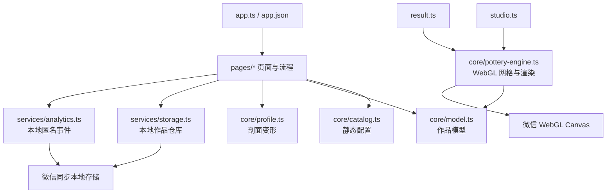

# 掌心窑项目指南（AI Agent 入口）

> 本文面向接手仓库的开发者和 AI agent，描述的是 **当前代码的真实状态**。需求愿景和完整验收标准见 `微信陶艺小程序产品需求文档_PRD.md`；当 PRD、README 与代码不一致时，以代码为准，并在改动前确认是补齐需求还是保持原型边界。

## 1. 项目速览

“掌心窑”是一个原生微信小程序陶艺创作原型。用户可以选择器形、泥料与引导模式，在七道工序中塑形、装饰、上釉、烧制和彩绘，最后查看、命名、复制、删除和导出作品。

当前仓库是纯客户端、纯本地数据的 v1 垂直切片：

- 无登录、后端、云函数、数据库、CDN 或网络请求。
- 无第三方运行时依赖；3D 陶坯由自写 WebGL 渲染器程序化生成。
- 作品、设置与匿名事件全部保存在微信小程序同步本地存储中。
- UI 使用原生 WXML/WXSS，所有页面均采用自定义导航栏。
- 当前没有 Git 元数据、锁文件、CI、Lint、格式化配置或组件库。
- `assets/` 目前为空；根目录两张 JPG 是产品/视觉参考图，没有被代码引用。

主流程：

```text
首页 index
  ├─ 新建 → 前置设置 setup → 创作台 studio
  ├─ 继续草稿 ──────────────→ 创作台 studio
  ├─ 本机作品集 gallery ─────→ studio（草稿）/ result（成品）
  └─ 工坊设置 settings

studio: 制坯 → 装饰 → 上釉 → 高温烧制 → 釉上彩绘 → 低温烤花 → 成品
                                                                  ↓
                                                               result
```

## 2. 技术栈与运行环境

| 层 | 当前技术 | 说明 |
| --- | --- | --- |
| 应用框架 | 微信小程序原生框架 | `App`、`Page`、WXML、WXSS，无自定义组件 |
| 语言 | TypeScript 5.9 | `strict`、`noImplicitAny`；模块目标为 CommonJS，编译目标 ES2018 |
| 3D | 原生 WebGL 1.0 Canvas | 自写着色器、网格生成、相机矩阵和渲染循环 |
| 2D 导出 | 微信 Canvas 2D | 用于 1080×1440 纪念海报合成 |
| 状态 | 页面实例字段 + `Page.data` | 没有全局状态库；作品编辑态主要由 `studio.ts` 持有 |
| 持久化 | `wx.getStorageSync` / `wx.setStorageSync` | 作品索引、作品本体、设置、教程标记、匿名事件 |
| 测试 | Node 内置 `assert` | 目前只有一份剖面算法测试，无测试框架 |
| 包管理 | npm | 只有 `typescript` 开发依赖；仓库没有 `package-lock.json` |
| 微信基础库 | 私有配置当前为 3.17.1 | `project.private.config.json` 会覆盖公共配置中的 3.7.0 |

项目没有浏览器开发服务器。正常运行方式是在微信开发者工具中导入仓库根目录。`project.config.json` 使用 `touristappid`，真机预览或上传前需要换成真实 AppID。

常用校验命令：

```bash
npm install
npm run typecheck
npm test
```

截至 2026-08-24，`npm run typecheck` 与 `npm test` 均通过。测试脚本不依赖微信运行时，但完整交互、WebGL、导出、相册权限和分享必须在微信开发者工具或真机验证。

## 3. 代码架构



分层边界：

- `pages/` 负责页面生命周期、导航、用户事件、页面状态和业务编排。
- `core/` 负责目录数据、作品模型、纯剖面算法和 WebGL 渲染。
- `services/` 负责微信本地存储这一外部边界。
- `types/` 只提供当前项目用到的最小微信全局声明，大量微信 API 仍是 `any`。
- 页面之间不共享内存状态，靠 URL 中的 `workId` 和本地存储重新取得作品。

当前没有依赖注入、Repository 类、组件层或独立状态机。`pages/studio/studio.ts` 是最主要的编排文件，也是改动风险最高的文件。

## 4. 核心数据与状态

### 4.1 `PotteryWork`

`core/model.ts` 中的 `PotteryWork` 是作品唯一结构化来源，主要字段如下：

| 字段 | 含义 |
| --- | --- |
| `workId` | 本地作品 ID，格式大致为 `work_<时间戳>_<随机串>` |
| `schemaVersion` | 当前固定为 `1` |
| `status` | `draft` 或 `completed` |
| `title` | 作品名，默认“我的{器形名}” |
| `currentStage` / `stageIndex` | 当前工序字符串与 0-based 索引，二者需要始终一致 |
| `shapeId` / `clayId` / `mode` | 器形、泥料、轻松/自由创作模式 |
| `height` | 陶坯高度，校验范围 0.45–1.8 |
| `outerRadius[48]` | 从底到口的 48 点外轮廓半径 |
| `innerRadius[48]` | 内腔半径；底部前两三个采样点通常为 0 |
| `decorations[]` | 装饰类型与位置参数；当前渲染只使用最后一个装饰的类型 |
| `glazeId` / `glazeMethod` | 釉色和施釉方式 |
| `paintColor` / `paintPattern` / `symmetry` | 彩绘色、程序化纹样编号和对称选项 |
| `createdAt` / `updatedAt` / `revision` | 本地时间与版本信息 |

新作品由 `createWork()` 创建：器形目录中的 8 点 profile 会线性采样为 48 点；内半径由外半径减去约 0.11 得到。

`validateWork()` 目前只检查 schema、外轮廓数组和长度，并钳制外半径与高度。它不会完整校验枚举值、内轮廓长度、阶段一致性或迁移旧 schema。新增字段或 schema 时必须同时处理默认值、校验和迁移，不能只改接口。

### 4.2 七道工序

顺序定义在 `core/catalog.ts`：

| 索引 | ID | 页面含义 | 主要行为 |
| --- | --- | --- | --- |
| 0 | `shaping` | 制坯 | 推拉剖面、开口、拉高、压低、收口、修口、修足、平滑 |
| 1 | `decorate` | 装饰 | 添加装饰记录，并映射为程序化表面纹样 |
| 2 | `glaze` | 上釉 | 选择 12 种釉和 4 种施釉方式 |
| 3 | `firing` | 高温烧制 | 播放约 3 秒的模拟窑烧进度，可跳过 |
| 4 | `paint` | 釉上彩绘 | 选择颜色和程序化纹样；不保存真实笔迹 |
| 5 | `refire` | 低温烤花 | 复用窑烧进度，然后进入成品阶段 |
| 6 | `finished` | 成品 | 再点击一次进入 `result` 页面 |

代码中多处直接依赖这些索引：`studio.wxml` 的釉色/彩绘面板使用 `2` 和 `4`，`model.ts` 与 WebGL 材质使用 `>=2`、`>=3`，界面文案多处硬编码 `/ 7`。增删或重排工序时必须全局搜索 `stageIndex`、`currentStage`、`/ 7` 和 `STAGES`。

### 4.3 本地存储键

| Key | 写入者 | 内容 |
| --- | --- | --- |
| `palm-kiln-settings` | `app.ts`、`settings.ts` | `sound`、`haptics`、`quality`、`guidance`、`reduceMotion` |
| `palm-kiln-work-index` | `services/storage.ts` | 按创建/首次保存顺序维护的作品 ID 数组；读取时再按 `updatedAt` 排序 |
| `palm-kiln-active-work` | `services/storage.ts` | 最近保存作品的 ID |
| `palm-kiln-work:<id>` | `services/storage.ts` | 完整 `PotteryWork` |
| `palm-kiln-tutorial-seen` | `studio.ts` | 是否收起过首次制坯提示 |
| `palm-kiln-analytics-v1` | `services/analytics.ts` | 最近 200 条匿名本地事件 |

存储是同步调用，没有配额处理、失败重试、云同步或跨设备恢复。删除作品会立即删除本体和索引，不是 PRD 所述的 7 天回收站。

### 4.4 页面内历史与自动保存

- 撤销/重做使用 `cloneWork()` 的完整 JSON 快照，分别放在 `history` / `future` 数组中。
- 最多保留 50 个历史快照，只存在当前 `studio` 页面内存中，不随草稿持久化。
- 手势编辑从按下到抬起合并成一次历史；大多数工具操作和工序推进也会推入历史。当前 `cycleSymmetry()` 是例外：它会保存但不会先创建撤销快照。
- `changed()` 会更新引擎和页面，设置“保存中…”，然后以 500 ms 防抖调用 `persist()`。
- 页面隐藏、卸载和主动退出也会立即持久化。
- `saveWork()` 更新的是待写入副本的 `updatedAt` / `revision`，没有把这两个值回写页面内的 `work`；因此 revision 目前更像“本次加载后的版本号”，不是严格的每次保存递增计数，部分页面也可能暂时展示保存前的时间。

## 5. 塑形与 WebGL 实现

### 5.1 剖面变形

`core/profile.ts` 是最接近纯业务逻辑的模块：

- `deformProfile()`：用以触点高度为中心的高斯核影响相邻采样点，单次 delta 被 strength 限制。
- `constrainProfile()`：半径限制为 0.18–1.25；轻松模式额外限制相邻采样斜率，并加固底部。
- `smoothProfile()`：用相邻点做简单平滑。
- `toolAction()`：处理拉高、压低、收口、修口、修足、平滑等离散工具。

单指按在 `studio` 中定义的陶坯矩形命中区内时编辑，按在背景时绕转相机；这里不是 3D 射线检测。双指手势同时控制缩放与旋转。自由模式只在直接推拉时跳过斜率保护，部分离散工具仍调用轻松模式约束。

### 5.2 网格

`PotteryEngine.rebuild()` 每次作品变化都会重建完整网格：

- 高度环固定取 `outerRadius.length`，正常为 48。
- 圆周段数由画质决定：低 48、中 64、高 88。
- 分别生成外表面和内表面，然后连接顶部口沿。
- 位置、法线和索引使用三个 WebGL Buffer；索引为 `Uint16Array`。
- 变形时当前没有局部 buffer 更新或触摸事件帧合并。

### 5.3 材质与相机

- 顶点着色器输出世界位置、法线和归一化高度。
- 片元着色器实现单方向漫反射、釉色混合、简化高光、4 种施釉遮罩和 4 种程序化装饰/彩绘纹样。
- 泥料在 `stageIndex >= 3` 后切换到烧后颜色；釉在上釉阶段以 0.72 混合，烧制后全量混合。
- 相机支持 orbit、dolly、回正和自动旋转，缩放被限制在 2.25–4.8。
- 渲染器创建 Canvas 时使用 `preserveDrawingBuffer: true`，供成品图导出。
- `destroy()` 停止循环并删除 GPU buffer/program；页面隐藏只暂停自动旋转，不销毁引擎。

## 6. 页面与业务调用链

### 首页 `pages/index`

`onShow()` 从存储读取最近更新的草稿；提供新建、继续、作品集和设置入口。首页视觉陶器全部由 WXSS 绘制，不使用 WebGL 或根目录 JPG。

### 前置设置 `pages/setup`

三步本地流程：选 5 种器形及创作模式、选 3 种泥料、点击练泥。完成时调用 `createWork()` → `saveWork()` → `track("creation_start")`，再 `redirectTo` 创作台。练泥可以跳过，次数不写入作品。

### 创作台 `pages/studio`

整个应用的核心控制器：

1. 按 URL `id` 加载作品。
2. 查询 WebGL Canvas 节点并创建 `PotteryEngine`。
3. 将触摸解释为编辑、单指观察或双指相机手势。
4. 按工序更新 `PotteryWork`，维护历史与 500 ms 自动保存。
5. 在烧制工序播放本地计时转场。
6. 完成第七阶段后导航至结果页。

Canvas 初始化失败时只显示静态 WXSS 陶器。用户仍能切工具和推进流程，但无法在真正的 2D 剖面编辑器中塑形。

### 作品集 `pages/gallery`

读取所有本机作品，支持“全部/草稿/已完成”过滤。缩略图是按器形和状态绘制的 WXSS 占位图，不是实际作品截图。点击草稿进入 `studio`，点击成品进入 `result`。

### 成品页 `pages/result`

加载作品后会立即把它标记为 `completed`、`finished`、阶段 6 并保存。页面支持 WebGL 旋转/缩放、重命名、复制、删除、生成 1080×1080 作品图、合成 1080×1440 海报、保存相册和微信分享入口。

三个光照预设目前只改变页面 CSS 背景；WebGL 着色器内的光方向不变。分享卡片只携带本地 `workId`，另一台设备没有对应本地作品数据时无法还原该作品。

### 设置页 `pages/settings`

直接读写设置对象。当前实际生效的主要是：

- `haptics`：控制轻震。
- `quality`：控制圆周网格段数。
- `reduceMotion`：部分场景控制自动旋转。

`sound` 没有对应音频实现，`guidance` 没有被创作台读取。创作模式 `work.mode` 与设置中的 `guidance` 是两个独立概念。

## 7. 完整目录与文件职责

```text
digital-ceramics/
├─ AGENTS.md
├─ README.md
├─ 微信陶艺小程序产品需求文档_PRD.md
├─ 制作陶瓷的场景.jpg
├─ 制作陶瓷的过程.jpg
├─ app.ts / app.json / app.wxss
├─ package.json / tsconfig.json
├─ project.config.json / project.private.config.json / sitemap.json
├─ assets/
├─ core/
├─ pages/
│  ├─ index/
│  ├─ setup/
│  ├─ studio/
│  ├─ gallery/
│  ├─ result/
│  └─ settings/
├─ services/
├─ tests/
└─ types/
```

### 7.1 根目录

| 文件/目录 | 内容与用途 |
| --- | --- |
| `AGENTS.md` | 本文；给开发者和 AI agent 的当前项目入口 |
| `README.md` | 面向普通开发者的简短功能清单、运行方法和原型边界 |
| `微信陶艺小程序产品需求文档_PRD.md` | 完整产品愿景、信息架构、需求、算法建议、埋点与验收；包含尚未实现内容，不能当作当前行为说明 |
| `制作陶瓷的场景.jpg` | 陶艺工坊、转盘与陶坯的视觉参考图；未被打包代码引用 |
| `制作陶瓷的过程.jpg` | “选泥—制坯—装饰—上釉—烧制—彩绘—烤花”的工序参考图；未被代码引用 |
| `app.ts` | 小程序启动入口；首次启动时写入默认设置 |
| `app.json` | 注册 6 个页面、全局自定义导航、v2 样式、sitemap 和组件懒加载 |
| `app.wxss` | 全局颜色变量、字体、按钮、安全区、标题和 panel 等基础样式 |
| `package.json` | 项目元数据、`typecheck`/`test` 脚本和 TypeScript 开发依赖 |
| `tsconfig.json` | 严格 TypeScript 配置；包含仓库内全部 `.ts`，类型根为 `types/` |
| `project.config.json` | 微信开发者工具公共配置；小程序类型、TS 编译插件、`touristappid`、基础库 3.7.0 等 |
| `project.private.config.json` | 本机开发者工具覆盖配置；当前把基础库覆盖为 3.17.1，并启用热重载/API Hook 等 |
| `sitemap.json` | 允许索引所有页面 |
| `assets/` | 预留资源目录，当前为空 |

### 7.2 `core/`

| 文件 | 内容与用途 |
| --- | --- |
| `core/catalog.ts` | 所有内置目录：5 种器形、3 种泥、12 种釉、7 道工序及各工序工具/提示文案 |
| `core/model.ts` | `PotteryWork`/`Decoration` 类型，新建、深拷贝、泥/釉颜色解析和最小作品校验 |
| `core/profile.ts` | 纯剖面算法：高斯形变、半径/斜率约束、平滑及离散制坯工具 |
| `core/pottery-engine.ts` | 最小 WebGL 引擎：矩阵、GLSL、网格/法线/索引生成、相机、材质、渲染循环和资源释放 |

### 7.3 `services/`

| 文件 | 内容与用途 |
| --- | --- |
| `services/storage.ts` | 本地作品 Repository：保存、读取、列表、最近草稿、复制、删除和草稿判断 |
| `services/analytics.ts` | 匿名事件写入本地，最多保留 200 条；当前没有上报端点 |

### 7.4 `pages/index/`

| 文件 | 内容与用途 |
| --- | --- |
| `pages/index/index.ts` | 首页生命周期、草稿检测和四个导航动作 |
| `pages/index/index.wxml` | 品牌 Hero、CSS 陶坯场景、继续/开始按钮和双入口底栏 |
| `pages/index/index.wxss` | 首页工坊场景、陶坯、转盘、工序环和入场动画 |
| `pages/index/index.json` | 当前页使用自定义导航栏 |

### 7.5 `pages/setup/`

| 文件 | 内容与用途 |
| --- | --- |
| `pages/setup/setup.ts` | 三步选择状态、练泥震动、新建并保存作品、记录开始事件 |
| `pages/setup/setup.wxml` | 器形横向卡片、创作模式、泥料卡片、练泥交互和底部下一步 |
| `pages/setup/setup.wxss` | 三步选择页、泥团和卡片的视觉与动效 |
| `pages/setup/setup.json` | 当前页使用自定义导航栏 |

### 7.6 `pages/studio/`

| 文件 | 内容与用途 |
| --- | --- |
| `pages/studio/studio.ts` | 核心业务控制器：加载、WebGL 初始化、手势、工具、阶段、历史、自动保存、窑烧和埋点 |
| `pages/studio/studio.wxml` | WebGL/兜底画面、顶部状态、引导、七步工序带、工具托盘、釉色/彩绘选择和窑烧遮罩 |
| `pages/studio/studio.wxss` | 沉浸式工坊、画布叠层、工序带、工具盘、兜底陶器和窑烧动画样式 |
| `pages/studio/studio.json` | 自定义导航并禁用页面滚动，触摸由 Canvas 接管 |

### 7.7 `pages/gallery/`

| 文件 | 内容与用途 |
| --- | --- |
| `pages/gallery/gallery.ts` | 加载作品列表、筛选、新建及按状态打开作品 |
| `pages/gallery/gallery.wxml` | 本机作品集、状态标签、双列卡片和空状态 |
| `pages/gallery/gallery.wxss` | 作品卡片、CSS 缩略陶器、筛选栏与空状态样式 |
| `pages/gallery/gallery.json` | 当前页使用自定义导航栏 |

### 7.8 `pages/result/`

| 文件 | 内容与用途 |
| --- | --- |
| `pages/result/result.ts` | 完成状态落盘、成品 WebGL 交互、灯光 UI、命名/复制/删除、图片/海报导出和分享配置 |
| `pages/result/result.wxml` | 成品展台、隐藏 2D 海报 Canvas、操作按钮、作品信息面板和图片预览层 |
| `pages/result/result.wxss` | 三种展台氛围、画布/底座、底部操作、信息面板、预览和兜底陶器 |
| `pages/result/result.json` | 自定义导航并禁用页面滚动 |

### 7.9 `pages/settings/`

| 文件 | 内容与用途 |
| --- | --- |
| `pages/settings/settings.ts` | 加载、切换并同步保存设置 |
| `pages/settings/settings.wxml` | 声音/触感/减少动态开关、引导强度、画质和本地隐私说明 |
| `pages/settings/settings.wxss` | 设置分组、选项、开关行和隐私说明样式 |
| `pages/settings/settings.json` | 当前页使用自定义导航栏 |

### 7.10 测试与类型

| 文件/目录 | 内容与用途 |
| --- | --- |
| `tests/profile.test.cjs` | 用 Node assert 验证高斯局部性、半径边界、NaN 和 100 次压力形变 |
| `types/index.d.ts` | `wx`、`App`、`Page`、`getCurrentPages` 及触摸事件的最小全局声明 |

## 8. 当前实现与 PRD 的重要差距

下面是接手时最容易误判的地方：

| 领域 | 当前真实实现 | PRD 目标/后续方向 |
| --- | --- | --- |
| 装饰 | 选择工具后追加固定位置记录，着色器把最后一种类型映射为全局纹样 | 器表定位、连续纹样、可编辑附件和不穿模杯耳 |
| 彩绘 | 颜色 + 1–4 的程序化纹样编号；没有真实笔迹 | 圆柱 UV 笔迹、橡皮、图层、跨接缝和对称绘画 |
| 对称 | 只循环保存 `symmetry` 值，渲染不消费它 | 无/左右/四向真实镜像 |
| 展台灯光 | 只切换 CSS 背景 | 不重载模型的真实光照预设 |
| WebGL 降级 | 静态 WXSS 陶器，可推进步骤但不可真正塑形 | 可完成核心流程的 2D 剖面编辑器 |
| 画质 | 用户手动决定 48/64/88 圆周段数 | 首次校准、运行时 FPS 监测和自动降档 |
| 自动旋转 | `reduceMotion` 只在部分初始化/手势结束路径生效 | 全流程一致地禁用非必要动画 |
| 声音/引导设置 | 值会保存，但没有音频系统，`guidance` 未接入提示逻辑 | 设置实时影响声音与技师提示强度 |
| 分享 | 分享路径仅含本地 ID，同设备外无法取得作品 | 可访问的作品预览/云数据与“同款创作”落地页 |
| 删除 | 立即移除本地数据 | 7 天可恢复回收站 |
| 复制成品 | 改为 `draft`，但保留原来的 `finished`/阶段 6，进入创作台后并不会回到制坯 | 明确“从哪个阶段继续”或创建可编辑的新版本 |
| 缩略图 | 按器形绘制通用 CSS 图 | 实际作品缩略图 |
| 撤销覆盖 | 对称选项不推历史；历史也不会跨页面重启恢复 | 所有作品变更可撤销，并按产品决策持久化关键历史 |
| 埋点 | 仅 `creation_start`、`first_deform`、`stage_complete`、`export_result`，且只存本地 | 完整漏斗、性能、错误与受控上报 |
| 数据恢复 | schema 1 的最小校验，无迁移/备份 | 兼容迁移、异常保留原始数据、云冲突处理 |
| 测试 | 单个 Node 脚本复制了一份算法 | 直接测试生产函数，以及页面、存储、WebGL、真机性能测试 |

另外，测试中的 `constrain()` / `deform()` 是生产算法的手工副本，而不是从 `core/profile.ts` 导入；修改生产算法时必须同步测试，最好后续建立可直接加载 TypeScript 源码的测试方案，避免测试与实现漂移。

## 9. 改动指南与不变量

### 常见改动落点

- 新增器形/泥料/釉色：先改 `core/catalog.ts`；若增加新行为，再检查 setup、studio、result 海报和 WebGL shader。
- 新增作品字段：改 `PotteryWork`、`createWork()`、`validateWork()`、复制/存储行为，并决定旧 schema 的默认值或迁移。
- 改制坯算法：改 `core/profile.ts`，同步/升级 `tests/profile.test.cjs`，再真机验证网格无 NaN、尖峰和翻面。
- 改渲染或材质：改 `core/pottery-engine.ts`；同时验证创作台、成品页、低/中/高画质和图片导出。
- 新增/重排工序：同时检查 `STAGES`、`TOOLS`、`studio.ts`、`studio.wxml`、`model.ts`、`pottery-engine.ts` 和所有硬编码的 7/阶段索引。
- 新增设置：在 `app.ts` 默认值、`settings.ts` 页面默认值、WXML 控件和实际消费模块四处保持一致。
- 新增页面：创建同名 `.ts/.wxml/.wxss/.json` 四件套，并先在 `app.json.pages` 注册。
- 改存储：保持 key 向后兼容；同步存储异常不能静默覆盖或删除现有作品。

### 必须维护的不变量

- `currentStage === STAGES[stageIndex].id`。
- `outerRadius` 和 `innerRadius` 的采样顺序始终从底到口，长度应一致。
- 外半径必须是有限数，且在安全范围内；内半径不得穿出外壁。
- 每次会改变作品的用户操作都应可撤销，并在短时间内持久化。
- 页面卸载必须停止定时器/渲染并释放不再使用的 GPU 资源。
- 不能在埋点中记录触摸点、笔迹、作品名、图片或其他创作原始内容。
- 相册权限只在用户主动保存图片时申请。

### 代码搜索建议

仓库较小，优先用 `rg` 做影响面确认：

```bash
rg "stageIndex|currentStage|STAGES|/ 7"
rg "palm-kiln-"
rg "quality|guidance|reduceMotion|haptics|sound"
rg "paintPattern|glazeMethod|decorations|symmetry"
rg "wx\." -g "*.ts"
```

## 10. 验证清单

每次逻辑改动至少执行：

```bash
npm run typecheck
npm test
```

涉及页面或 WebGL 时，在微信开发者工具做以下冒烟测试：

1. 首次启动能写入默认设置；无草稿时首页正常。
2. 5 种器形、3 种泥料和两种模式都能创建作品。
3. 制坯推/拉、开口、离散工具、背景旋转、双指缩放与回正互不误触。
4. 连续形变后无 NaN、破面或明显尖峰；撤销/重做与 500 ms 保存状态正确。
5. 七道工序可完成，两个窑烧转场都能等待或跳过。
6. 退出/切后台/重新进入后能恢复草稿和当前阶段。
7. 作品集过滤与草稿/成品路由正确；命名、复制、删除行为符合预期。
8. 成品旋转、导出作品图、合成海报、拒绝/允许相册权限均可用。
9. 分别用低/中/高画质初始化 WebGL；模拟 WebGL 失败时不白屏。
10. 开启“减少动态”后检查创作台和成品页的自动旋转是否符合需求。

## 11. 建议的接手顺序

第一次接触项目时，建议按以下顺序阅读：

1. `README.md`：了解产品范围。
2. `app.json` 与 `core/catalog.ts`：掌握路由、工序和全部可选项。
3. `core/model.ts` 与 `services/storage.ts`：掌握数据契约和持久化。
4. `core/profile.ts` 与测试：掌握塑形约束。
5. `pages/studio/studio.ts`：掌握主状态机、手势和保存链路。
6. `core/pottery-engine.ts`：掌握网格与着色器。
7. `pages/result/result.ts`：掌握完成、导出与作品管理。
8. PRD 中与当前任务相关的章节：判断是在维护原型还是补齐产品目标。

如果任务只是修页面样式，不必先深入 GLSL；如果任务涉及作品字段、工序或存储，必须先完整阅读 model、storage 和 studio 三处，因为它们共同构成当前的数据一致性边界。
