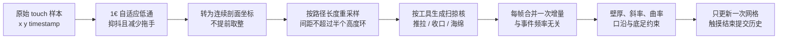

# 制坯页面优化调研与实现方案

> 调研日期：2026-08-24  
> 调研范围：制坯页的转盘、塑形手势、舞台布局、工坊背景与陶坯光照  
> 约束：本文只给出调研结论与实施方案，不修改现有业务代码、数据结构或视觉资源。

## 1. 结论摘要

本次优化不应只做一轮 WXSS 美化。当前体验的核心问题同时存在于“运动参数、输入采样、剖面算法、场景层次、真实光照”五个层面，建议按以下优先级实施：

1. **先修塑形输入与剖面连续性**：把当前“每个 `touchmove` 只改一个高度点”的处理升级为“时间归一化、轨迹重采样、整段扫掠变形、局部无收缩修顺”。这是影响手感和器形质量最大的改动。
2. **把现有海绵变成真正的局部修复手法**：用户选中海绵后可沿器壁上下搓动，轨迹经过的侧壁被连续压平；选择工具本身不再立刻全局改形。
3. **统一陶坯与转盘的动态转速**：当前两处均为 18 秒一圈，即约 `3.33 RPM`，属于展示台慢转，不像拉坯。建议成型阶段按器物宽度取约 `32–44 RPM`，手指接触时降至 `22–30 RPM`，并平滑过渡。
4. **转盘继续采用轻量 2.5D 绘制**：将单层米色椭圆拆成挡泥盆、铝合金轮头、侧沿、固定孔、同心车纹、泥浆水迹和接触阴影。这样既能保持低开销，也能让 WebGL 失败时仍有完整场景。
5. **器底接触线从当前 70% 下移到约 74%**：短屏在 72%–73%，长屏可到 75%，CSS 转盘与 WebGL 相机共用同一个值，不能各自硬编码。
6. **背景采用“暗青灰窑坊”而非写实大图**：用低对比木构梁架、远处坯架与三只陶碗、工作台透视线和一处暗窑拱形成空间；中央保持干净，避免背景抢走操作焦点。
7. **聚光效果由两层共同完成**：背景用柔和椭圆光晕收拢视线，WebGL 中提高工坊主光并加入曝光/色调映射；不能只用 CSS 把陶坯周围刷白。

建议第一版不改变 `PotteryWork` schema，也不引入第三方运行时依赖。48 点剖面足以得到流畅结果，问题主要在输入路径没有连续覆盖、约束存在方向偏置、平滑手法过于粗糙，以及每个触摸事件都重建整套网格。

---

## 2. 当前实现审计

### 2.1 转盘与位置

- `pages/studio/studio.wxml` 中的转盘只有 `wheel → wheel-spin → ring/trace` 三层结构。
- `pages/studio/studio.wxss` 将转盘放在舞台高度的 `70%`，宽 `640rpx`、高 `170rpx`，主体是单层灰褐色椭圆。
- CSS 动画 `wheel-turn` 使用 `18s linear infinite`。
- `core/pottery-scene.ts` 的 `POTTERY_TURNTABLE_PERIOD_MS` 同样是 `18000`，WebGL 陶坯也是 18 秒一圈。
- 两处数值相同，但没有共享运行时状态；后续若加接触减速，很容易出现陶坯与转盘速度不同步。
- 当前同心环本身几乎无法表达旋转，只能依靠一条径向亮纹判断速度，因此低速时更像展台而不是工作中的陶轮。

### 2.2 塑形手势

当前塑形主链路位于 `pages/studio/studio.ts`：

```text
touchmove
→ 取本次事件 dx / dy
→ 对 dx 做固定系数低通
→ 将当前 y 四舍五入到一个剖面索引
→ 在该索引附近执行一次高斯形变
→ 立即重建网格并 setData
```

现有实现已经有几项正确基础：

- 左右侧会根据 `side` 统一换算“向外/向内”。
- 单次横移被限制到 14 CSS px，避免延迟事件造成大跳变。
- 一次按下到抬起只记一条撤销历史。
- WebGL 命中测试与高度映射已从固定矩形升级为基于相机投影的近似计算。

但侧面曲线容易不顺，原因很明确：

1. **只消费事件点，不消费两事件之间的路径**：手指一次从剖面索引 10 跳到 15，中间 11–14 没有按真实轨迹连续处理。
2. **固定事件低通不考虑时间**：`filteredDx = 0.55 * old + 0.45 * new` 的结果依赖设备事件频率；30 Hz 与 120 Hz 重放同一手势会得到不同器形。
3. **纯上下移动几乎不产生有效处理**：形变只取 `dx`，所以用户沿侧壁上下搓动时，经过的轮廓不会自然被修顺。
4. **高度被过早取整**：`profileIndexAtCanvasY()` 返回整数，触点跨环时会产生台阶式切换。
5. **轻松模式的斜率限制只有自底向上的正向扫描**：会把误差单向传递到上部，存在方向偏置；它只限制一阶斜率，不直接抑制二阶曲率尖峰。
6. **自由模式只做半径钳制**：自由度不等于允许生成明显折线；最低限度的拓扑安全和曲率保护仍应存在。
7. **海绵是一次全局按钮**：`smoothProfile()` 只做一次 `0.25 / 0.5 / 0.25` 平均，既不是用户沿器壁操作，也缺少局部修复能力。
8. **每次事件都完整重建网格与索引并调用 `setData`**：触摸事件频率高于显示帧率时会做无效工作，低端机上反而更容易卡顿和断线。

### 2.3 背景与光照

- 背景目前是青灰到深灰的直线渐变，加一条横向搁板、一块桌面和右上斜光。
- 画面有明暗基础，但没有明确透视消失点、前中后景，也没有能被识别为陶瓷作坊的安静细节。
- `core/pottery-engine.ts` 已有工坊主光和补光，片元着色器使用环境项、漫反射、高光、菲涅耳和内腔遮蔽；这比纯 CSS 假高光更适合继续增强。
- 当前线性色最终直接 `clamp(0, 1)` 再做 gamma。若只提高灯光强度，浅色瓷泥容易直接截成白块，因此需要同时加入轻量曝光或色调映射。

### 2.4 与 PRD 的关系

现有 PRD 已写明几项尚未真正落地的关键约束：

- 陶坯持续旋转，用户操作时自动降低转速，松手后平滑恢复。
- 上下拖动时，工具应沿器壁移动并连续作用于经过的高度。
- 触摸采样需要低通滤波，但不能明显拖手。
- 连续事件应合并到下一帧处理。
- 背景使用低细节几何、渐变或轻量图片，陶坯优先于写实场景。

因此本方案属于补齐当前产品设计，不需要改变七道工序或作品存储契约。

---

## 3. 真实陶轮调研与产品参数

### 3.1 设备结构与速度事实

厂商公开资料给出的现代电动陶轮共同特征如下：

- NIDEC-SHIMPO VL-WHISPER 使用 14 英寸轻合金轮头、脚踏调速、双向旋转，额定范围 `0–250 RPM`，轮头带固定坯板的孔位；同时提供两片式挡泥盆。[NIDEC-SHIMPO 官方产品页](https://www.shimpoceramics.com/shimpo-vl-whisper/)
- Speedball Big Boss 使用 14 英寸轮头、脚踏无级调速、`0–240 RPM`，配两片式可拆挡泥盆。[Speedball 官方产品页](https://www.speedballart.com/big-boss-pottery-wheel/)
- Skutt 的产品说明强调可拆轮头、挡泥盆和脚踏的平滑速度过渡。[Skutt 官方陶轮页](https://skutt.com/pottery-wheels/)

`240–250 RPM` 是机器能力上限，不是拉壁阶段应该常驻的动画速度。陶艺教学资料强调速度取决于泥量、泥性、器形和手部控制：转速要足以帮助泥料运动，又必须低到能稳定控制；拉壁通常使用中速，双手内外夹持，从底部连续提到口沿。[Skilled Centering](https://ceramicartsnetwork.org/pottery-making-illustrated/pottery-making-illustrated-article/Skilled-Centering)、[Wheel Throwing in Cross Section](https://ceramicartsnetwork.org/daily/article/wheel-throwing-in-cross-section/)

一项对六名熟练陶工的实地研究还发现：陶工从预成型进入成型阶段时会降低转速，泥量更大或器物直径更大时也会进一步降速；研究认为手与器物接触处的线速度是关键控制量。[Gandon 等，2021](https://doi.org/10.1016/j.jasrep.2021.102987)

### 3.2 本项目推荐转速

本项目没有高速“定中心”交互，用户进入页面时已经有基础器形，因此只模拟成型与观察阶段。推荐以下首轮参数：

| 状态 | 窄器形（杯、瓶） | 宽器形（碗、盘） | 单圈时间 | 说明 |
| --- | ---: | ---: | ---: | --- |
| 空闲成型 | 44 RPM | 32 RPM | 1.36–1.88 s | 明显快于当前，同时仍是可观察的中低速 |
| 手指塑形 | 30 RPM | 22 RPM | 2.00–2.73 s | 接触时降低线速度，提升控制感 |
| 相机观察 | 24 RPM | 18 RPM | 2.50–3.33 s | 避免相机环绕与自转叠加得过快 |
| 减少动态 | 0 RPM | 0 RPM | 静止 | 保持现有无障碍语义 |

推荐按实时最大外半径连续插值，而不是按 `shapeId` 写死：

```text
width = clamp((maxRadius - 0.55) / (1.10 - 0.55), 0, 1)
idleRPM   = lerp(44, 32, width)
activeRPM = lerp(30, 22, width)
periodMs  = 60000 / RPM
```

这些是面向移动屏幕的产品起始值，不是陶艺行业唯一标准。上线值必须通过真机录像和陶艺体验者盲测微调。建议接触减速用约 240–300 ms，松手恢复用约 360–450 ms；速度变化使用连续角速度插值，不能直接跳变动画时长。

### 3.3 转盘外观方案

保留 WXML/WXSS 的 2.5D 方案，拆成以下层次：

```text
wheel-root（只负责位置和裁切）
├─ splash-pan-back      深灰绿挡泥盆后沿
├─ wheel-head           铝合金轮头，真正旋转
│  ├─ machined-rings    6–8 道低对比同心车纹
│  ├─ bat-pin × 2       两个小固定孔/塞点
│  └─ slip-mark         一段不对称半透明泥浆弧线
├─ splash-pan-front     挡泥盆前沿，遮住轮头下半部
├─ spindle-band         深色侧沿/机身暗示
└─ contact-shadow       陶坯落在轮头上的柔软接触阴影
```

视觉规格建议：

- 挡泥盆外宽约 `650–680rpx`，轮头宽约 `500–530rpx`，形成接近真实设备的层级比例。
- 轮头用冷灰铝色，而不是与泥完全同色；建议从 `#A7A39A` 到 `#6F726E` 的低饱和金属渐变。
- 前沿厚度控制在 `28–38rpx`，用一条窄高光和下方暗边表现厚度。
- 同心纹主要提供材质，不负责表达转动；一段泥浆弧和两个固定孔提供可跟踪的旋转线索。
- 泥浆痕只使用 1–2 处、透明度低于 0.22，避免变成脏污贴图。
- 接触阴影宽度随器底半径变化，中心最深、边缘柔化，使陶坯不再像悬浮在盘面上。
- 主路径与 WebGL 陶坯使用同一目标 RPM；轻量兜底仍显示同一套转盘。

不建议本轮把完整转盘改造成新的 WebGL 模型。当前页面已有透明 WebGL 陶坯，2.5D 转盘能以更低成本获得稳定层次，也能覆盖 WebGL 失败场景；真正需要三维遮挡或脚踏设备展示时，再评估统一进 WebGL。

---

## 4. 真实塑形手法与数字交互映射

### 4.1 真实手法要点

陶轮拉坯并不是用一根手指在某一点反复戳动：

- **推/撑**：内侧手指向外施力，外侧手或工具提供支撑，形成鼓腹或曲面。
- **拉壁/提拉**：内外手指像卡尺一样夹住泥壁，从底部到口沿做一次连续、缓慢的上移；完整的一次提拉应留下渐进而非断裂的螺旋痕。
- **捏/收口**：外侧均匀施力并继续向上移动，保持弧线；只在一个高度横向挤压容易形成台阶或塌肩。
- **搓/压实**：海绵、软刮片或型板随轮转贴住器壁，压实、去除多余泥浆并修正曲线。型板贴着旋转器形能够得到均匀轮廓，柔性刮片可在收口后恢复连续曲线。[Making Multiples](https://ceramicartsnetwork.org/daily/article/Making-Multiples-Using-Templates-to-Throw-Uniform-Shapes-on-the-Pottery-Wheel)
- **润滑与轻压**：水或泥浆减少摩擦，但过度润滑会削弱泥壁；数字产品不需要模拟含水量失败，但应把“轻压、连续、可修复”的感觉保留下来。

### 4.2 推荐交互语义

| 用户动作 | 数字行为 | 结果 |
| --- | --- | --- |
| 手指横向推/拉 | 沿法线方向改变局部半径 | 鼓起或收窄，强度与位移和时间相关 |
| 手指斜向移动 | 对经过的整段高度连续分配径向变化 | 不再出现事件点之间的凹凸断层 |
| 手指近似竖直移动 | 保持体积，给经过区域极轻的压实修顺 | 上下搓动不会“什么都没发生” |
| 选择“收口”后上下滑 | 对轨迹应用负向半径核并带向上连续性 | 形成连续颈线，不是一键缩上半部 |
| 选择“海绵”后上下搓 | 对轨迹邻域执行局部无收缩平滑 | 可定点修复鼓包、折线和尖峰 |
| 松手 | 做一次小幅最终约束并提交一条历史 | 没有继续变形的惯性，结果可撤销 |

双指仍只控制相机，不引入“双指捏泥”。这是当前产品重要不变量，避免塑形和缩放产生歧义。真实的双手内外支撑通过算法中的对称壁厚约束和曲率保护表达，而不是要求用户在手机上模拟两只手。

---

## 5. 塑形算法实施方案（重点）

### 5.1 新处理管线



### 5.2 输入滤波

新增一个无微信运行时依赖的 `core/shaping-input.ts`：

- 保存每个手势的 `lastRawPoint`、`filteredPoint`、`lastTimestamp`、`lastAppliedProfileY`、累计径向意图和待处理样本队列。
- 使用 1€ Filter 分别处理 x/y。该算法在慢速时降低抖动，在快速移动时自动提高截止频率以减少延迟，适合触摸和跟踪输入。[CHI 2012 论文](https://gery.casiez.net/publications/CHI2012-casiez.pdf)、[作者维护的实现](https://github.com/casiez/OneEuroFilter)
- 首轮调参范围：`minCutoff 1.2–1.8 Hz`、`beta 0.01–0.03`、`dCutoff 1.0 Hz`。不要直接把某个示例值当最终值，应使用录制手势回放确定。
- 过滤使用真实 `dt`，并保护重复时间戳、负时间和后台恢复后的超大间隔。
- 不依赖 `Touch.force`。部分设备不提供稳定压力值，首版用位移速度和停留时间推导“力度”；若以后接入压力，只能作为可选增益。

### 5.3 连续路径重采样

当前整数索引映射改为连续坐标 `profileY ∈ [0, 47]`。相邻过滤点之间形成线段，再按以下规则重采样：

- 垂直方向每跨越最多 `0.5` 个高度环产生一个样本；屏幕像素间距只作为下限保护。
- 同一原始线段的横向增量平均分配给所有重采样点，不能给每个点重复施加完整 `dx`，否则快速跨越多个高度会被放大。
- 一帧内所有样本先聚合成 `deltaRadius[48]` 和 `weight[48]`，最后只应用一次。
- 径向变化使用“单位时间最大变化率”钳制，而不是“每个事件最大变化量”。首轮建议最大 `0.24–0.32 model unit/s`，再按真机手感调整。
- 同一条录制路径以 30/60/120 Hz 重放时，最终轮廓应基本一致。

### 5.4 扫掠变形核

保留高斯局部影响的思路，但从“单点核”改为“沿路径扫过的核”：

```text
weight(i, sample) = exp(-(i - sampleY)^2 / (2 * sigma^2))
delta[i] += sampleDelta * weight(i, sample)
```

推荐初始值：

- 手指推/拉：`sigma = 3.2–4.0` 个高度环。
- 收口：上部区域 `sigma = 4.0–5.0`，并带轻微向上方向权重，避免形成水平凹槽。
- 海绵：覆盖 `2.5–4.5` 个高度环，只修改局部曲率，不直接追随横向位移。
- 纯竖直手指轨迹：不新增明显体积，只在经过区域施加约 3%–6% 的弱压实平滑；用户想强力修复时应主动选择海绵。

### 5.5 约束与无收缩修顺

建议把 `core/profile.ts` 拆成清晰的四步：

1. `applySweptDeformation()`：只生成候选轮廓。
2. `constrainWall()`：半径和最小壁厚。
3. `constrainSlopeAndCurvature()`：双向限制斜率与二阶曲率。
4. `smoothProfileRange()`：海绵或收手时的局部修顺。

具体要求：

- 斜率约束必须进行“自底向上 + 自顶向下”成对扫描，消除当前单向偏置。
- 轻松模式可使用更严格的一阶斜率和二阶差分阈值；自由模式阈值更宽，但仍需保证有限值、最小半径、最小壁厚和不会产生极端折线。
- 平滑只作用于笔触包围盒外扩约 `2σ` 的区域，底足前两点和口沿最后两点使用较低权重，避免海绵把结构特征抹掉。
- 不使用反复普通 Laplacian 平均作为最终方案。虚拟陶艺研究证明它可以去硬边，但每帧全局使用开销较高，并会持续收缩器形；B 样条具有更好的全局光滑性，但局部自由度较低。[Procedural Mesh Manipulation for Virtual Pottery Simulation with Hand Tracking](https://www.mdpi.com/2076-3417/16/11/5233)
- 推荐在 1D 剖面上使用局部、带权的 Taubin 式双通平滑，或“拉普拉斯平滑 + 局部体积补偿”。初始可尝试 `λ≈0.45`、`μ≈-0.47`，但必须用体积漂移测试确认，不能仅凭视觉确定。
- 平滑前后计算局部近似体积 `Σ(r² * Δh)`；单次海绵笔触的体积漂移目标小于 1%，修正量必须受限，避免为了守体积产生新的肩部鼓包。
- 外轮廓变化后，内轮廓按原壁厚同步移动，再钳制到最小安全壁厚；不能继续用“取旧内半径和 `outer - 常量` 的较小值”这种单向逻辑。

### 5.6 海绵修复工具

这是本次需求中最重要的显式修复能力：

- 选择“海绵”只切换工具，不立即修改作品，也不立刻推入历史。
- 手指命中器身后，沿侧壁上下滑动；经过区域的高频曲率被压平，整体轮廓、底足和口沿尽量保持。
- 停留在一点时只缓慢增强到上限，不能按事件次数无限塌缩。
- 手指离开后做一次很小的最终收束，并把整段作为一个撤销步骤。
- 提示文案改为“沿器壁上下轻抹，修顺凹凸”，第一次使用可短暂显示一条竖向轨迹示意。
- 若用户只想一键救形，可后续再增加“长按海绵卡片：轻修整器”的二级动作；首版先把直接触摸修复做好，避免同一按钮同时承担选择和执行。

### 5.7 帧调度与网格更新

- `touchmove` 只入队，不直接多次重建网格。
- 使用 Canvas 的 `requestAnimationFrame` 或引擎现有帧循环，在每帧开始前合并待处理样本，最多更新一次陶坯。
- WebGL 路径中不需要每个事件都 `setData({work})`；变形时直接更新引擎，页面文案和保存状态做限频同步，抬手后再完整同步。
- 当前拓扑在同一画质档、同一采样数下不变。实施时缓存索引和静态属性，只更新位置与法线 buffer；不要每次重新上传索引。
- 先实现“每帧一次完整位置/法线更新”，确认正确后再评估局部 `bufferSubData`。48×64 的规模不值得一开始引入难维护的复杂脏区系统。
- 手势开始时暂停或减速自动转动，手势结束后恢复；相机观察时也避免自转与手动 orbit 叠加。

---

## 6. 布局、背景与光照方案

### 6.1 视觉主题

主题命名为 **“暮色窑坊的一束工光”**。

具体主体是面向零基础用户的移动端制坯台，页面唯一工作是让用户看清并顺畅塑造当前陶坯。标志性画面不是通用深色渐变，而是：**低位精密陶轮上方的一件亮陶坯，远处木构窑坊的透视线和窗光都悄悄指向它。**

古建筑元素只取可识别的结构语言，不做历史场景复原。景德镇公开资料显示传统展示建筑常见穿斗式木构架、天井和徽派建筑语汇，传统窑坊/作坊本身为生产提供分层工作空间。[景德镇市政府：陶瓷民俗博物馆](https://www.jdz.gov.cn/zjcd/mljdz/sj/t933000.shtml)、[景德镇陶瓷文化生态保护规划](https://jdz.gov.cn/zwgk/zfgb/2024n/d3q/szfwj_3307/t958190.shtml)、[UNESCO 景德镇御窑遗址说明](https://whc.unesco.org/en/tentativelists/6265)

### 6.2 色彩 Token

| 名称 | 建议色值 | 用途 |
| --- | --- | --- |
| 窑夜墨 | `#171C1A` | 最深边缘、前景暗角 |
| 青灰墙 | `#2C3732` | 工坊主墙面 |
| 旧梁木 | `#4B392D` | 梁柱、搁板和桌沿 |
| 陶土暗影 | `#675446` | 陶碗剪影与近景泥色 |
| 窗纸冷光 | `#AAB8AF` | 远处窗口低透明冷光 |
| 工灯暖白 | `#F1E1C5` | 陶坯主光与中心背景光晕 |

保留现有青釉与瓷白 UI Token，不改全局字体。标题继续用宋体，操作文字继续用系统无衬线，避免本轮扩散到全应用视觉重做。

### 6.3 舞台布局

```text
┌──────────────────────────────┐
│ 顶栏：退出      作品名      撤销 │
├──────────────────────────────┤
│ 木梁剪影 ╲       微弱窗光      │
│   远处坯架   ○  ○  ○          │
│             制坯标题/提示       │
│                                │
│           [ 明亮陶坯 ]          │
│              │                 │
│      ═══ 铝合金轮头 ═══        │  ← 接触线约 74%
│       ╲ 挡泥盆前沿 ╱           │
├──────────────────────────────┤
│ 七道工序带                     │
│ 工具托盘 / 完成本步             │
└──────────────────────────────┘
```

- 将 `POTTERY_BASE_SCREEN_Y` 从 `0.70` 调整为动态的 `0.72–0.75`，常规长屏基准 `0.74`。
- 短屏优先保证轮头不与工序带、工具托盘重叠；长屏才继续下移，不能简单在所有设备固定写 `75%`。
- WebGL 相机、命中测试、剖面 y 映射、CSS 转盘顶沿共用同一个 `baseScreenY`，由页面初始化计算后同时传入。
- 下移时保持当前器形视觉尺度，不把陶坯同步缩小；目标是把有效上方操作空间增加约 4% 的舞台高度。
- 提示卡片避开陶坯肩口。长提示可移到左上或标题下方，但不得覆盖用户正在搓动的侧壁。

### 6.4 背景分层

全部用 WXML/WXSS 轻量元素完成，不新增大体积写实背景图：

1. **远景墙面**：暗青灰径向渐变，中心比边缘亮约 8%–12%。
2. **木构框架**：左侧一根竖柱、上方一根梁、右后方一条斜向梁，形成指向陶坯的透视；不绘满整座建筑。
3. **远处坯架**：画面一侧放一条细搁板和三只大小不同的陶碗剪影，透明度约 0.14–0.22，略微虚化。
4. **暗窑拱**：另一侧仅露出一个低对比拱形暗部，作为陶艺语义，不加跳动窑火。
5. **工作台平面**：地平线略低于画面中部，用两三条极淡收束线表达纵深。
6. **暗角**：四边轻微压暗，中心保留干净的负空间。

背景不使用持续动画。唯一显著运动应是转盘/陶坯，符合“把大胆用在一个地方”的设计原则，也兼容减少动态设置。

### 6.5 陶坯聚光

分两层实现：

**背景层**

- 在陶坯背后增加约 `420–520rpx` 的暖灰椭圆光晕，中心透明度控制在 0.16–0.24。
- 光晕上缘略偏左，对应 WebGL 主光方向；边缘必须软，不能像发光圆盘。
- 转盘下方仍保持暗，使亮度集中在器身而不是整个舞台。

**WebGL 层**

- 扩展 `LightingPreset`，把环境、主光、补光和曝光做成显式参数，而不是继续写死在 GLSL 常量中。
- 工坊预设首轮可把环境项从当前约 `0.25` 调至 `0.28–0.31`，主光系数从 `0.68` 调至约 `0.78–0.84`，补光保持克制。
- 主光从左上偏前方落下，阴影侧保留冷色补光，形成清晰但不硬的体积。
- 在 gamma 前增加轻量曝光和 Reinhard 类色调映射，避免白瓷泥和高光直接截白。
- 内腔仍应明显更暗，口沿与肩部可稍亮；不要把“提亮主体”理解为抬高所有像素。
- 接触阴影由转盘 DOM 层承担，暂不增加实时阴影贴图或后处理。

---

## 7. 未来代码改动清单

> 以下是实施阶段的目标文件；本轮不执行这些改动。

| 文件 | 计划改动 |
| --- | --- |
| `pages/studio/studio.wxml` | 重组背景和转盘层级；绑定统一转速、接触状态与基准线变量 |
| `pages/studio/studio.wxss` | 新转盘、暗青灰工坊、透视梁架、陶碗剪影、光晕、接触阴影和响应式下移 |
| `pages/studio/studio.ts` | 用结构化手势状态替代 `any`；样本入队、每帧消费、工具策略、转速状态、触摸结束提交 |
| `core/shaping-input.ts`（新增） | 1€ Filter、时间归一化、路径重采样和异常样本保护 |
| `core/profile.ts` | 扫掠变形、局部平滑、双向斜率/曲率约束、内外壁一致性 |
| `core/pottery-scene.ts` | 动态 RPM、角速度平滑、响应式 `baseScreenY`；保留帧率无关推进 |
| `core/pottery-engine.ts` | 连续剖面坐标、每帧一次几何更新、拓扑缓存、动态灯光参数与曝光映射 |
| `core/pottery-mesh.ts` | 将固定拓扑与动态位置/法线更新分离；确保底、口沿和内腔仍完整 |
| `tests/profile.test.cjs` | 改为直接加载生产 `core/profile.ts`，删除当前手抄算法，增加路径与平滑回放测试 |
| `tests/pottery-engine.test.cjs` | 增加动态转速、基准线、不同器形宽度和帧率一致性测试 |
| `tests/shaping-input.test.cjs`（新增） | 过滤、重采样、30/60/120 Hz 等价性、异常时间戳和方向反转测试 |

明确不需要改动：

- `PotteryWork` schema 与存储 key。
- 七道工序顺序。
- 作品迁移逻辑。
- 全局字体和其他页面主题。
- 第三方 UI、3D 或手势依赖。

---

## 8. 分阶段实施顺序

### 阶段 A：输入与剖面质量

1. 先补生产算法直测，建立同一路径不同采样率的失败用例。
2. 新增连续剖面坐标、1€ Filter 和路径重采样。
3. 将变形合并到每帧一次。
4. 实现双向斜率/曲率约束和内外壁同步。
5. 把海绵改为沿轨迹局部修顺。
6. 只完成这一阶段就做第一轮真机盲测；若塑形仍不顺，不应先靠灯光和背景掩盖。

### 阶段 B：转盘运动与布局

1. 把 RPM、交互状态和 `baseScreenY` 变成页面与引擎共享参数。
2. 增加按器物直径调整速度、接触减速和松手恢复。
3. 下移接触线并完成短屏保护。
4. 重绘转盘层级，验证主路径和 WebGL 兜底一致。

### 阶段 C：背景与聚光

1. 先完成暗青灰墙、木构透视、坯架和陶碗剪影。
2. 加中央暖光晕和暗角，截图检查背景是否抢主体。
3. 最后调 WebGL 主光、补光、曝光和色调映射。
4. 逐一验证三种泥料、五种器形，不能只对白瓷杯调色。

### 阶段 D：性能与验收

1. 自动化算法回放。
2. 微信开发者工具交互冒烟。
3. 低、中、高三档真机性能采样。
4. 5–8 名用户无讲解测试，至少包含 1–2 名有真实拉坯经验者。

---

## 9. 验收标准

### 9.1 塑形质量

- 同一条预录手势以 30/60/120 Hz 重放，最终每个半径点差异不超过 `0.005` model unit，或整体误差不超过 2%。
- 一次从器壁 20% 高度滑到 80% 高度的笔触，中间不得出现未覆盖超过 1 个高度环的空洞。
- 连续 50 次上下海绵修顺后无 NaN、翻面、内外壁穿插，局部体积累计漂移不超过 3%。
- 手指方向快速反转时不出现明显“继续向旧方向鼓起”的拖尾。
- 轻松模式 20 次随机大幅推拉后仍保持连续曲线；自由模式可以更尖锐，但不得产生肉眼可见的折线法线断层。
- 海绵可以只修中段，不应明显改变口沿、底足和未触及的另一段轮廓。
- 每次按下至抬起仍只产生一条撤销记录；第二根手指加入时不写入额外形变。

### 9.2 转盘与布局

- 当前约 3.33 RPM 提升到设计区间后，陶坯与盘面目标 RPM 一致，交互减速和恢复无突跳。
- 宽盘的转速明显低于窄杯，但用户不需要理解或配置速度。
- 开启“减少动态”后，陶坯和轮头都停止，背景无残余运动。
- 在至少 `320×568`、`375×812`、`430×932` 三档 CSS 视口中，陶坯顶端、提示卡、工序带和转盘不互相遮挡。
- 器底前沿与轮头接触线误差不超过舞台高度的 1.5%，缩放后不出现明显悬浮或插入。

### 9.3 视觉

- 背景一眼能读出“陶艺工坊”，但缩小截图后最先看到的仍应是陶坯，而不是木梁、窑口或陶碗。
- 陶坯主体平均可见亮度相对当前提高约 15%–25%，暗侧仍有体积，白瓷高光无大面积纯白截断。
- 三种泥料在制坯阶段仍能辨认原有色相，不因暖光全部变成同一种黄色。
- 转盘能看出挡泥盆、轮头和前沿三层结构；静止截图也有精致度，不依赖动画掩盖造型。
- 背景陶碗最多 3–4 个，透明度低、无高饱和釉色，不与工具托盘竞争。

### 9.4 性能

- 触摸到可见形变 P95 不高于 50 ms。
- 每个显示帧最多一次剖面应用和一次 WebGL 几何更新。
- 中高档目标机型制坯 P75 不低于 50 FPS，低档不低于 28 FPS。
- 10 分钟持续制坯、缩放和撤销后无持续内存增长，页面退出后渲染循环与 buffer 正常释放。
- `npm run typecheck`、`npm test` 全部通过；生产剖面算法不再由测试手抄副本代替。

---

## 10. 风险与控制

| 风险 | 表现 | 控制方式 |
| --- | --- | --- |
| 过滤过强 | 手指和陶坯之间有拖拽感 | 用 1€ Filter 随速度提高截止频率；以 P95 延迟和盲测共同调参 |
| 扫掠增量被重复放大 | 快速斜滑造成大鼓包 | 把线段总增量分配给重采样点，并按时间限制最大径向速度 |
| 平滑导致器形缩水 | 多次海绵后越来越瘦 | 局部双通平滑、体积漂移测试、底足/口沿保护 |
| 自由模式仍出现折线 | 光照下有硬折 | 自由模式放宽约束但不关闭曲率安全线 |
| 转盘变快产生视觉频闪 | 同心纹或高光跳动 | 降低对比、减少等距高频纹、用不对称低透明泥浆弧表达旋转 |
| CSS 与 WebGL 运动不一致 | 装饰阶段看出滑动 | 共享目标 RPM 和状态；切后台/恢复时同时重置时间基准 |
| 下移后短屏拥挤 | 转盘压住工序带 | `baseScreenY` 使用 0.72–0.75 响应式范围并加安全间距测试 |
| 背景过度设计 | 操作焦点被抢 | 限制 3 个主题元素、低饱和低对比、中央负空间、静态背景 |
| 提亮后白瓷过曝 | 高光丢失形体 | 在线性色域做曝光/色调映射，不直接增加最终 sRGB 颜色 |

---

## 11. 调研资料

### 陶轮设备与转速

- [NIDEC-SHIMPO VL-WHISPER 官方规格](https://www.shimpoceramics.com/shimpo-vl-whisper/)
- [Speedball Big Boss 官方规格](https://www.speedballart.com/big-boss-pottery-wheel/)
- [Skutt Potter's Wheels 官方说明](https://skutt.com/pottery-wheels/)
- [A preliminary study of rotation velocity regulation in pottery wheel-throwing](https://doi.org/10.1016/j.jasrep.2021.102987)

### 拉坯与修顺手法

- [Skilled Centering](https://ceramicartsnetwork.org/pottery-making-illustrated/pottery-making-illustrated-article/Skilled-Centering)
- [Wheel Throwing in Cross Section](https://ceramicartsnetwork.org/daily/article/wheel-throwing-in-cross-section/)
- [Making Multiples: Using Templates to Throw Uniform Shapes on the Pottery Wheel](https://ceramicartsnetwork.org/daily/article/Making-Multiples-Using-Templates-to-Throw-Uniform-Shapes-on-the-Pottery-Wheel)

### 数字塑形与输入滤波

- [Procedural Mesh Manipulation for Virtual Pottery Simulation with Hand Tracking](https://www.mdpi.com/2076-3417/16/11/5233)
- [1€ Filter: A Simple Speed-based Low-pass Filter for Noisy Input in Interactive Systems](https://gery.casiez.net/publications/CHI2012-casiez.pdf)
- [作者维护的 OneEuroFilter 多语言实现](https://github.com/casiez/OneEuroFilter)

### 工坊视觉语汇

- [景德镇市政府：景德镇陶瓷民俗博物馆](https://www.jdz.gov.cn/zjcd/mljdz/sj/t933000.shtml)
- [景德镇陶瓷文化生态保护区总体规划](https://jdz.gov.cn/zwgk/zfgb/2024n/d3q/szfwj_3307/t958190.shtml)
- [UNESCO：Imperial Kiln Sites of Jingdezhen](https://whc.unesco.org/en/tentativelists/6265)

---

## 12. 最终建议

本次优化的判断标准不应是“转盘更花、背景更满”，而应是：用户一上手就能感到陶轮在工作，手指移动与泥壁变化连续一致，做坏的局部能沿器壁上下轻抹修回来，并且无论器形和屏幕尺寸如何，陶坯始终是唯一视觉重心。

实施时应先完成阶段 A 的手感与算法闭环，再进入视觉阶段。若只先改背景、光照和转盘，页面会更好看，但用户最在意的侧面折线和无法修复问题仍然存在。
