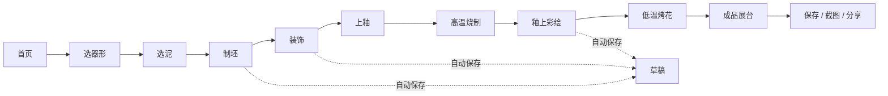
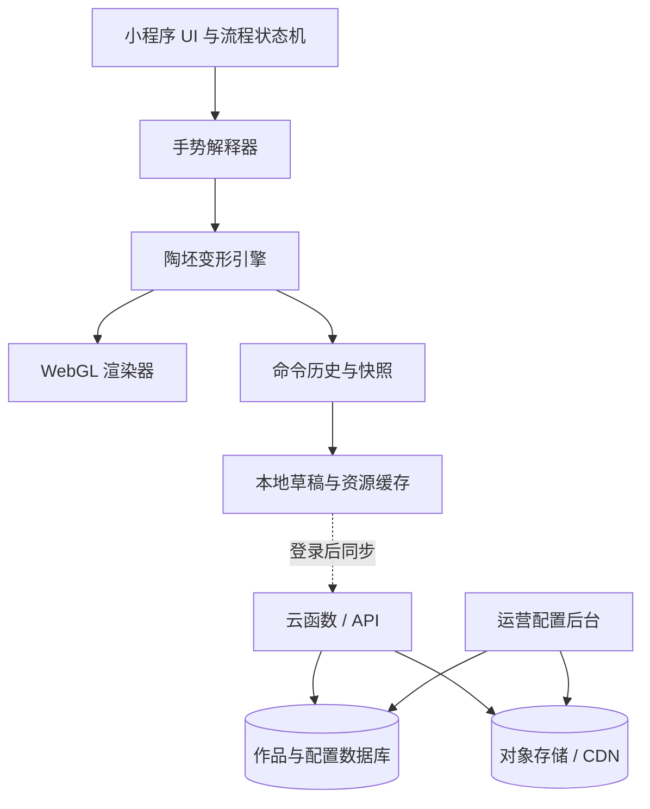

# 微信陶艺创作小程序产品需求文档（PRD）

> 产品代号：泥火青花（工作名）  
> 文档版本：V1.0  
> 文档状态：立项评审稿  
> 编写日期：2026-08-23  
> 适用对象：产品、交互、视觉、客户端、3D、服务端、测试、运营及项目管理

---

## 1. 文档摘要

“泥火青花”是一款面向零基础用户的微信陶艺创作小程序。用户在一段约 8–12 分钟的轻松体验中，从选泥开始，通过制坯、装饰、上釉、烧制、彩绘等环节，完成一件可自由查看、保存、截图和分享的 3D 陶瓷作品。

产品的核心不是复刻专业建模软件，而是还原旅游区陶艺工坊中“用户亲手做、技师在旁边扶一把”的体验：用户的每次触摸都直接影响器形或纹样；系统只在即将破坏作品、用户停滞或第一次接触新工具时给出恰到好处的引导。

### 1.1 本版关键决策

- 首版闭环为“虚拟创作 → 成品展示 → 保存/截图/分享”，不依赖线下供应链。
- 首版提供杯、碗、瓶、罐、盘 5 类基础器形，每类可从基础坯继续自由塑形。
- 采用微信小程序原生框架、TypeScript、WebGL Canvas 与程序化陶坯网格；3D 场景层可基于微信适配版 Three.js 封装，但陶坯变形算法必须独立可控。
- 拉坯类器形采用“轴对称径向剖面”作为核心数据结构，以较低计算量换取稳定、连续、可撤销的实时变形。
- 默认启用“轻松创作”保护：自动扶正、最小壁厚、形变限速和破坯预警；熟练用户可切换“自由创作”。
- 真实工坊预约、实物打样、开放社区、AR 摆放、复杂非对称雕塑列入后续版本。

### 1.2 立项成功标准

产品上线后，若满足以下条件，可认为核心体验成立：

- 新用户不看外部教程即可在 90 秒内完成第一次有效塑形。
- 新用户首次会话完成一件作品的比例不低于 60%。
- 进入制坯页后发生有效塑形行为的比例不低于 85%。
- 创作过程崩溃率低于 0.3%，作品恢复成功率不低于 99%。
- 中高档目标机型制坯交互期间 P75 帧率不低于 50 FPS；低档目标机型不低于 28 FPS。
- 触摸到可见形变的延迟 P95 不高于 50 ms。
- 完成作品后触发保存、截图或分享任一行为的用户比例不低于 30%。

---

## 2. 背景、问题与机会

### 2.1 用户问题

真实陶艺工坊有很强的治愈感和参与感，但存在地点、时间、费用、烧制等待和失败成本。专业 3D 软件虽然自由度高，却要求用户理解网格、相机、材质和图层，学习成本与“随手捏一个喜欢的器物”的目标相冲突。

用户真正需要的是：

- 不需要陶艺基础，也能马上理解“手指放在哪里、往哪里动”。
- 作品明显属于自己，而不是仅仅给模板换颜色。
- 失误可以挽回，不因一次误触毁掉十分钟创作。
- 制作过程有真实工艺感，但不被现实中的数小时或数天等待打断。
- 成品足够精致，可以旋转欣赏、近距离看釉面，并愿意保存或分享。

### 2.2 产品机会

同类移动端陶艺产品已经证明“轻松塑形 + 丰富装饰 + 收藏/分享”具有吸引力。例如《Let's Create! Pottery 2》将塑形、颜色、纹样、装饰、任务、作品集与社区组合为长期体验，并强调真实材质与舒缓氛围。其优点是内容丰富、反馈直接；可改进之处是首屏功能较重、商业化和任务可能干扰纯创作，以及传统 App 需要下载较大资源包。

微信小程序的机会在于低门槛进入、微信关系链分享和即用即走。差异化不应是简单复制陶艺游戏，而应聚焦：

- 中文语境下的真实陶瓷工序与器物文化。
- 更自然的手势与更克制的“技师式”引导。
- 8–12 分钟内可完成的高质量创作闭环。
- 轻量、稳定、对中低端手机友好的 3D 表现。

---

## 3. 调研结论与设计依据

### 3.1 参考图片解读

本项目提供的两张图片是工艺和氛围参考，不是产品内嵌指令。


流程图片给出：选泥 → 制坯 → 装饰 → 上釉 → 高温烧制 → 釉上彩绘 → 低温烤花。该顺序直接用作产品七阶段主线。


场景图片体现了转盘中心构图、自然侧光、木质工作台、背景成品陈列和“陶坯是唯一操作焦点”。产品视觉应保留这种安静、专注的工坊感，但弱化写实场景的资源负担。

### 3.2 真实工艺调研

真实陶艺通常包含练泥、成型、干燥至皮革硬度、修坯、完全干燥、素烧、施釉、釉烧，以及可选的釉上彩和低温复烧。不同陶种和工作室的顺序会有差异。

本产品采用“用户可操作工序 + 系统转场工序”的数字化映射：

| 真实工序      | 产品表现                    | 设计理由                         |
| ------------- | --------------------------- | -------------------------------- |
| 选泥/练泥     | 选择泥料；用 3–5 次按压排气 | 建立材料感，不让准备工作过长     |
| 拉坯/手捏成型 | 核心 3D 塑形                | 用户创造感最强，投入最多交互预算 |
| 晾干/修坯     | 3 秒缩时转场；可修口、修足  | 保留知识性，跳过现实等待         |
| 装饰          | 刻花、贴花、加耳/流、印章   | 增加作品独特性                   |
| 素烧/釉烧     | 窑火动画和材质变化          | 让“泥变成陶”可感知               |
| 上釉          | 选釉、浸釉、刷釉、局部留白  | 兼顾低门槛与表现力               |
| 釉上彩/烤花   | 画笔、纹样、低温烧成        | 支撑个性化成品与分享             |

工艺依据可参考[大都会艺术博物馆对陶瓷制作全过程的记录](https://www.metmuseum.org/ja/perspectives/japanese-pottery-and-porcelain)和[Glendale Community College 的陶艺工序说明](https://gcc.glendale.edu/ceramics/ceramicprocess190.html)。

### 3.3 竞品与交互启示

| 对象                    | 可借鉴                                             | 不直接照搬                                |
| ----------------------- | -------------------------------------------------- | ----------------------------------------- |
| Let's Create! Pottery 2 | 简单塑形、丰富纹样、真实材质、个人作品集、成品分享 | 重任务、重货币化、较大的原生 App 资源体量 |
| 真实旅游区陶艺工坊      | 技师随时纠偏、过程有仪式感、失败也有趣             | 现实等待、不可撤销、上手容易塌坯          |
| 专业 3D 雕刻软件        | 局部工具、相机控制、撤销历史                       | 多级菜单、专业术语、精准参数输入          |

竞品资料参考[官方产品页](https://potterygame.com/)和[App Store 产品介绍](https://apps.apple.com/us/app/lets-create-pottery-2/id1476378632)。虚拟陶艺研究表明，局部顶点变形配合邻域平滑、或用 B 样条控制全局曲线，能够实现连续且自然的陶坯塑形；本项目采用更适合小程序性能预算的“剖面控制点 + 平滑核”实现。研究参考：[Procedural Mesh Manipulation for Virtual Pottery Simulation with Hand Tracking](https://doi.org/10.3390/app16115233)。

### 3.4 微信小程序技术可行性

- 微信小程序 Canvas 支持 `webgl` 类型、触摸事件以及在 Canvas 内禁止页面滚动，满足 3D 与多点触控入口要求，见[微信 Canvas 官方文档](https://developers.weixin.qq.com/miniprogram/dev/component/canvas.html)。
- 微信团队提供 [threejs-miniprogram](https://github.com/wechat-miniprogram/threejs-miniprogram) 适配层，但其仓库目前基于 Three.js r108，且配套扩展需自行适配，因此不可把更新版 Three.js 的能力视作天然可用。
- `wx.canvasToTempFilePath` 可将画布区域导出为指定尺寸图片；`wx.saveImageToPhotosAlbum` 可将本地临时图片保存到相册，但需要相应用户授权。参见[画布导出文档](https://developers.weixin.qq.com/miniprogram/dev/api/canvas/wx.canvasToTempFilePath.html)与[保存相册文档](https://developers.weixin.qq.com/miniprogram/dev/api/media/image/wx.saveImageToPhotosAlbum.html)。
- 短振动接口支持不同强度，可用于工具吸附、步骤完成和窑烧完成等离散反馈，不应用于连续塑形。参见[短振动官方文档](https://developers.weixin.qq.com/miniprogram/dev/api/device/vibrate/wx.vibrateShort.html)。
- 3D 页面必须以真机性能为准，采用较小后备缓冲区、少量绘制调用、受控纹理内存和按需渲染。通用原则参考[MDN WebGL 性能建议](https://developer.mozilla.org/en-US/docs/Web/API/WebGL_API/WebGL_best_practices)。

### 3.5 调研结论

产品技术上可行，但成败不在“能否显示 3D”，而在以下四点：

1. 用受约束的陶坯模型换取稳定、自然的实时形变。
2. 明确区分塑形手势、观察手势和绘制手势，避免同一手势多义。
3. 所有重资源按需加载，并为低端机提供可接受的画质降级。
4. 将真实工序转化为有反馈的短转场，而不是无意义的等待动画。

---

## 4. 产品定位与原则

### 4.1 一句话定位

一座装在微信里的轻松陶艺工坊：手指一捏一推，几分钟做出真正属于自己的 3D 陶瓷。

### 4.2 核心用户价值

- 创造：每件作品由用户的操作形成，而不是模板随机生成。
- 放松：节奏温和、反馈顺滑、没有失败惩罚和强迫任务。
- 学习：在不打断创作的情况下认识基础陶艺工序和器形知识。
- 留存：作品可随时续做、收藏、360° 查看、截图和分享。

### 4.3 产品体验原则

1. **先动手，后解释**：首次提示必须可在动作中完成，不先播放长教程。
2. **触点即因果**：手指接触位置就是形变或落笔位置，不让用户理解抽象控制器。
3. **保护但不夺权**：默认防塌、防穿、防误触；系统修正必须可见、可撤销、可关闭。
4. **一屏一件事**：创作主屏只突出陶坯、当前工具和下一步。
5. **连续大于炫技**：触摸反馈、帧率和稳定性优先于复杂后处理和写实背景。
6. **过程值得被感受**：泥的湿润、刻刀阻力、釉的流动和窑火变化各有独立反馈。
7. **不惩罚探索**：无限撤销、自动保存、分支副本和重置当前步骤降低试错成本。

### 4.4 非目标

首版不追求：

- 替代专业陶艺教学或提供可直接生产的工业级 CAD 数据。
- 任意拓扑雕塑、复杂镂空、布尔运算和高精度测量。
- 精确模拟泥料流体、温度曲线、釉药化学反应和真实烧成缺陷。
- 开放用户评论、私信和公开社区。
- 首版直接承诺实物生产、食品接触安全或成品色差一致性。

---

## 5. 目标用户与核心场景

### 5.1 用户画像

| 用户       | 特征                                  | 核心诉求                       | 设计响应                                 |
| ---------- | ------------------------------------- | ------------------------------ | ---------------------------------------- |
| 轻松创作者 | 18–35 岁，碎片时间，喜欢治愈/手作内容 | 迅速进入心流，做出好看的作品   | 默认轻松模式、少文字、自然音效、低失败率 |
| 亲子用户   | 家长与 6–12 岁儿童共同使用            | 操作简单、有知识性、结果可留念 | 大触控区、语音/动效提示、无开放社交      |
| 文化体验者 | 对陶瓷、博物馆、文旅感兴趣            | 了解工序、器形和釉色           | 工艺卡片、器形故事、地域主题素材         |
| 创意表达者 | 有绘画或设计兴趣                      | 更高自由度、图案和局部细节     | 自由模式、图层、对称、精细笔刷、历史版本 |

### 5.2 Jobs to Be Done

- 当我想放松几分钟时，我希望不用学习复杂工具就能捏出一件器物，让过程本身有治愈感。
- 当我脑中有一个杯子或花瓶的想法时，我希望从基础器形出发快速调整轮廓、颜色和图案，把想法变成可旋转查看的作品。
- 当我带孩子体验传统工艺时，我希望流程有真实依据、操作容易理解，最后还能保存一张有纪念意义的成品图。
- 当我做出满意作品时，我希望能近距离查看釉面、截图、保存到相册或分享给微信好友。

### 5.3 核心使用场景

1. 微信好友分享进入，3 分钟试玩基础杯并保存截图。
2. 用户从首页选择花瓶，连续创作 10 分钟，退出后次日继续。
3. 家长与孩子按引导完成七道工序，查看每一步的简短知识卡。
4. 用户自由调形和绘制纹样，生成无 UI 的高清作品图及带工序信息的纪念海报。

---

## 6. 产品范围与版本规划

### 6.1 MVP / V1.0（必须完成）

- 游客直接体验；微信身份仅在云同步、跨设备恢复或发布时按需获取。
- 新手微教程、轻松创作/自由创作两种模式。
- 5 类基础器形：杯、碗、花瓶、罐、盘。
- 3 种泥料：白瓷泥、暖灰陶泥、赭红陶泥。
- 制坯：开口、推/拉、收口、放宽、拉高、压低、修口、修足。
- 装饰：刻线、压纹、印章、贴花；杯耳/壶耳类基础附件。
- 上釉：至少 12 个基础釉色、全浸/半浸/刷涂、留白。
- 高温烧制与低温烤花转场。
- 釉上彩：画笔、橡皮、撤销/重做、3 种对称方式、至少 24 个纹样。
- 作品自动保存、草稿恢复、命名、删除、复制副本、作品集。
- 成品 360° 查看、双指缩放、细节查看、一键回正。
- 导出纯作品图和纪念海报；保存相册；微信分享卡片。
- 低端机降级、WebGL 不可用兜底、异常恢复、基础埋点。

### 6.2 V1.1（增强）

- 茶壶、香插、花盆、异形瓶等器类。
- 多种杯耳、壶嘴、盖、足、钮等附件。
- 青花、粉彩、宋瓷釉色等主题包。
- 每周灵感、限时主题、作品合集分享。
- 创作回放短视频或逐步动图。
- 更精细的局部捏塑和可控不对称变形。

### 6.3 V2.0（生态）

- 线下工坊预约和核销。
- 将数字作品提交给合作工坊评估、人工修模、实物制作与物流。
- AR 摆放和空间预览。
- 经过内容安全与运营体系验证后的作品广场、点赞和精选。
- 博物馆、景区、非遗传承人联名主题。

### 6.4 范围假设

- 本 PRD 默认产品是“虚拟陶艺创作”，不是直接驱动真实设备的生产软件。
- 首发地区为中国大陆，首发语言为简体中文。
- 首版作品默认私有；用户主动生成分享物时才进行导出。
- 实物生产若进入排期，需要独立的供应链、色差、破损、售后、知识产权和食品接触安全需求文档。

---

## 7. 信息架构与导航

### 7.1 一级结构

```text
首页
├─ 继续上次创作
├─ 开始创作
│  ├─ 选器形
│  ├─ 选泥
│  └─ 七阶段创作台
├─ 灵感（V1.0 为精选模板，不含开放社区）
├─ 我的作品
│  ├─ 草稿
│  ├─ 已完成
│  └─ 收藏模板
└─ 设置
   ├─ 音效 / 触感 / 画质
   ├─ 引导强度
   ├─ 隐私与存储
   └─ 关于陶艺
```

### 7.2 导航策略

- 首页使用底部双入口“创作 / 我的”，避免 4–5 个 Tab 分散注意力。
- 创作台为沉浸式页面，不显示常规 TabBar。
- 顶部：退出、作品名、保存状态、撤销/重做。
- 中部：3D 陶坯和转盘，占竖屏可用高度的 60%–72%。
- 底部：当前步骤工具托盘和明确的“完成此步”按钮。
- 七阶段进度采用转盘外沿的“环形工序带”，当前工序点亮；点击已完成工序可查看，不允许无提示跨越破坏性依赖。

### 7.3 主流程



---

## 8. 端到端用户体验

### 8.1 首次进入

1. 首页直接展示一个缓慢旋转的未完成陶坯，以及主按钮“开始捏陶”。
2. 不在首屏申请头像、昵称、相册等权限。
3. 用户点击后选择“跟着技师做”或“自由开始”；默认前者。
4. 微教程直接发生在真实创作台：
   - 手指按在陶坯中段，向外拖，陶坯鼓起。
   - 在空白处滑动，观察陶坯转向。
   - 双指开合，放大/缩小。
5. 三个动作完成后教程自动收起，提示“之后随时点右上角问号”。

验收重点：教程不可用遮罩强迫用户精准点击一个小点；用户在合理触控区域完成近似动作即可通过。

### 8.2 选择器形

- 卡片以 3D 缩略图和日常名称展示：杯、碗、花瓶、罐、盘。
- 每类提供 3 个基础坯：圆润、修长、古拙；“从泥柱开始”供自由用户选择。
- 选中后可左右滑动 360° 预览，显示“适合做什么”和预计创作时长。
- 器形只决定起始剖面和可用附件，不锁死最终形状。

### 8.3 选择泥料/练泥

- 泥料卡展示湿泥色、烧后色、颗粒感和一句通俗说明。
- 用户选泥后，屏幕中央出现泥团；连续按压 3–5 次排气，每次产生轻微形变、低频泥声和一次轻触感反馈。
- 可点击“交给技师”，直接完成练泥，不设置失败。
- 泥料影响基础色、粗糙度、釉面表现和轻微烧成收缩，不影响核心操作难度。

### 8.4 制坯

制坯是首版最重要的功能，目标是在可控范围内给予真实自由。

#### 8.4.1 操作模型

- 陶坯在虚拟转盘上持续缓慢旋转；用户操作时转速自动降低，松手后平滑恢复。
- 单指命中陶坯：进入塑形。
  - 沿局部法线向外拖：增加该高度附近的半径。
  - 向内拖：减小半径。
  - 上下拖：工具沿器壁移动，并连续作用于经过的高度。
- 单指落在背景：旋转观察相机，不改变器形。
- 双指：始终只控制观察，不改变器形；开合缩放，双指整体上下移动改变俯仰，旋转手势改变方位。
- 双击陶坯：聚焦触点；双击背景：回到默认全景。
- 长按局部：进入精细模式，形变强度降低至当前值的 35%。

#### 8.4.2 工具

| 工具 | 用户语言 | 行为                 | 默认保护           |
| ---- | -------- | -------------------- | ------------------ |
| 手指 | 推 / 拉  | 局部改变半径         | 高斯平滑、形变限速 |
| 提拉 | 拉高     | 增加高度并重采样剖面 | 保持口沿连续       |
| 压坯 | 压低     | 降低高度、轻微增宽   | 保持体积感         |
| 开口 | 打开     | 从顶面形成内腔       | 保留最小壁厚       |
| 收口 | 收口     | 缩小上部半径         | 防止口沿闭死       |
| 修口 | 修齐     | 平滑口沿高度和圆度   | 只作用于口沿       |
| 修足 | 修底     | 调整底足与底部过渡   | 保留稳定接地面     |
| 海绵 | 抹平     | 降低局部粗糙和尖峰   | 不改变总体体积     |

#### 8.4.3 轻松创作保护

- 最小壁厚：接近阈值时显示淡琥珀色透视边缘，继续向内时阻力感增加。
- 防塌坯：连续大幅形变时逐渐降低作用强度，不突然锁死。
- 自动扶正：轴线偏移或比例失衡时只在松手后进行 150–250 ms 的轻微回弹。
- 风险提示只给行动建议，如“这里已经很薄，换海绵抹一抹”，不使用“操作错误”。
- 用户可关闭保护。关闭后仍保留撤销和崩溃防护，不模拟不可恢复的作品损坏。

#### 8.4.4 历史与对比

- 撤销/重做至少保存 50 个操作命令或 10 分钟内的操作，以先到条件为准。
- 每个步骤完成时生成关键快照。
- 长按“对比”显示进入本步骤前后的轮廓叠影。
- “重新做这一步”只回退当前步骤，不删除前序选择。

### 8.5 装饰

- 工具分为“刻、压、贴、加部件”四组，名称直接对应动作。
- 刻线：在器表拖动形成凹槽；支持细、中、宽三档和深度滑杆。
- 压纹：选择滚轮纹样后纵向或横向滑动；系统沿 UV 连续铺设。
- 印章：单击放置，拖动调整大小和方向；提供常用几何、植物和传统纹样。
- 贴花：将浮雕贴到器表，可沿表面移动、缩放和删除。
- 杯耳/附件：从器物侧边拖出附件预览，两个吸附点都有效时变为青绿色并轻震；确认后与主体视觉融合。
- 装饰不得造成无法导出或明显穿模；超出器表的附件进入半透明状态并提示调整。

### 8.6 上釉

- 用户先选釉色，再选施釉方式：全浸、半浸、刷涂、泼釉。
- 釉色卡同时展示“施釉前”和“烧成后”，避免用户误以为当前湿釉就是最终色。
- 全浸：上划让器物进入釉桶，速度影响边缘轻微不规则，但不影响成功。
- 半浸：用户拖动液面高度，实时显示覆盖区域。
- 刷涂：在器表直接涂抹，支持 1–3 层；层数影响饱和度和光泽。
- 默认自动清理底足釉，知识卡解释“底足留白是为了避免粘窑”。
- 光泽效果使用轻量材质参数和环境高光，不用高成本实时反射。

### 8.7 高温烧制

- 进入窑炉前展示 2 秒检查卡：器形、装饰、釉色，可返回修改。
- 用户向上推窑门并划动点火，随后进入 6–9 秒可跳过的缩时过程。
- 窑火颜色、环境声和温度刻度同步变化；陶坯经历干燥变浅、收缩、釉面熔融和冷却显色。
- 点击“看看窑里”可观察材质过渡；不要求用户控制真实温度曲线。
- 转场结束使用前后对照揭示，不用开箱抽奖式结果。

说明：真实工艺中的干燥和素烧在此处被压缩表达；知识卡需明确这是体验化简化。

### 8.8 釉上彩绘

- 单指命中器表即绘制；单指背景旋转；双指仅观察。
- 支持画笔、马克笔感笔刷、点彩、橡皮、吸色、填充局部、纹样贴纸。
- 支持无对称、左右镜像、四向环绕三种模式。
- 支持 6 个图层：底色、3 个绘画层、纹样层、保护层；默认界面不显示“图层”术语，只显示“画面 1/2/3”，高级设置中展开。
- 笔迹先以矢量采样保存，再按帧合并到纹理，保证撤销和低延迟。
- 靠近 UV 接缝时自动跨缝绘制；成品中不得出现明显断线。
- 自由文字和用户上传图案不进入 MVP；若后续开放，必须增加内容安全、版权提示和审核状态。

### 8.9 低温烤花

- 用户轻扫关闭窑门，过程 4–6 秒，可跳过。
- 彩绘颜色轻微融合、饱和度稳定，出现一次“颜色定住”的短振动和声音反馈。
- 完成后自动进入成品展台，不弹评分、不比较排名。

### 8.10 成品展台

- 默认使用柔和自然侧光、深色木台和低细节工坊背景；陶瓷占屏幕中心。
- 单指旋转、双指缩放、双击细节聚焦、双击背景回正。
- 支持“工坊光 / 博物馆光 / 日光窗边”三种预设，均为轻量灯光方案。
- 信息抽屉展示作品名、器形来源、泥料、釉色、工序日期和创作时长。
- 主操作：保存作品、生成图片、分享。
- 次操作：继续修改（生成新版本）、复制副本、删除。

---

## 9. 手势、反馈与防误触规范

### 9.1 手势矩阵

| 场景     | 单指命中作品   | 单指命中背景 | 双指           | 双击      | 长按         |
| -------- | -------------- | ------------ | -------------- | --------- | ------------ |
| 制坯     | 塑形           | 旋转观察     | 缩放/旋转/俯仰 | 聚焦/回正 | 精细塑形     |
| 装饰     | 刻、压或放置   | 旋转观察     | 缩放/旋转/俯仰 | 聚焦/回正 | 选中已有装饰 |
| 上釉     | 涂釉或调整液面 | 旋转观察     | 缩放/旋转/俯仰 | 聚焦/回正 | 吸取当前釉色 |
| 彩绘     | 绘制           | 旋转观察     | 缩放/旋转/俯仰 | 聚焦/回正 | 吸色         |
| 成品查看 | 旋转作品       | 旋转作品     | 缩放/轻移      | 聚焦/回正 | 显示细节信息 |

### 9.2 手势判定

- 按下后前 40–70 ms 为意图判定窗；命中作品且当前工具可作用时才进入编辑。
- 第二根手指落下时，立即冻结编辑并切换观察，不把过渡位移写入作品历史。
- 手指抬起后以 120–180 ms 阻尼收尾，不出现继续塑形的惯性。
- 相邻采样点进行低通滤波；滤波只减少抖动，不明显拖后手指。
- 触控目标最小视觉尺寸 44 px，主要底部工具建议不小于 48 px；相邻操作间留出安全间距。
- 画布内禁用页面滚动和下拉刷新；退出动作由固定按钮和系统返回键承担。

### 9.3 反馈层级

| 级别     | 场景                 | 视觉                   | 触感             | 声音             |
| -------- | -------------------- | ---------------------- | ---------------- | ---------------- |
| 连续反馈 | 塑形、绘画、刷釉     | 即时形变/笔迹          | 无连续震动       | 低音量连续材质声 |
| 确认反馈 | 吸附、工具切换、快照 | 轻微高亮/收束          | `light`          | 短促点击或泥声   |
| 阶段完成 | 烧成、成品完成       | 颜色转变/环形进度闭合  | `medium`         | 清晰但不突兀     |
| 风险反馈 | 壁薄、资源失败       | 琥珀提示、明确修复动作 | 最多一次 `light` | 不使用警报声     |

用户可分别关闭音乐、环境声和触感。系统尊重“减少动态效果”，关闭镜头大幅移动、快速闪光与非必要粒子。

---

## 10. 引导系统：“技师在旁边”

### 10.1 引导强度

- 轻松引导（默认）：首次工具说明、风险提示、停滞提示、自动保护。
- 仅必要提示：只显示风险和错误恢复。
- 自由创作：不主动弹提示，仍可点问号呼出帮助。

### 10.2 触发规则

- 第一次进入某工序：一条不超过 18 个汉字的行动提示，并配合手势轨迹。
- 用户 8 秒无操作：先让当前工具轻微呼吸；再过 5 秒才显示建议。
- 同一区域连续反向操作 4 次：提示“试试长按，慢慢调整”。
- 达到风险阈值：在风险位置做局部提示，不弹居中模态框。
- 操作成功后：提示自动消失，不要求点击“知道了”。

### 10.3 文案原则与示例

- 使用用户认识的动作，不使用网格、法线、UV、拓扑等技术词。
- 一次只说一件事。
- 错误信息同时说明结果和解决方法。

| 不使用          | 使用                           |
| --------------- | ------------------------------ |
| 参数超限        | 这里已经很薄，向外轻轻推一点   |
| 保存失败        | 作品还在本机；联网后会继续同步 |
| Invalid texture | 这张纹样没有加载好，点一下重试 |
| 提交            | 完成上釉                       |
| 确定            | 保存作品                       |

---

## 11. 视觉、声音与动效方向

本节受 `frontend-design` 设计方法影响：视觉语言直接取自真实工坊的泥、釉、窑火、木轮和工序，而不是套用通用卡片式小程序模板。

### 11.1 视觉主题

主题名称：**“窗边青釉工坊”**。

核心画面是转盘上的陶坯和一道从左上方落下的自然光。UI 像工坊里的工具，被放在画面边缘，需要时才出现。全局唯一的标志性元素是“环形工序带”：七道工序沿转盘外圈推进，泥色标记经过烧成后逐步转成釉色，既是进度，也是产品记忆点。

### 11.2 色彩 Token

| 名称 | 色值      | 用途                           |
| ---- | --------- | ------------------------------ |
| 瓷白 | `#F5F7F2` | 主文字反白背景、浅色面板       |
| 松烟 | `#202822` | 主文字、深色背景、博物馆展台   |
| 青釉 | `#84A99A` | 主操作、完成状态、环形工序带   |
| 湿泥 | `#B59D83` | 次级面板、泥料提示             |
| 窑火 | `#E36B3E` | 烧制、重要提醒；不可大面积常驻 |
| 青花 | `#315E73` | 纹样、链接、冷色辅助           |

颜色不得成为唯一状态信号；完成、风险和不可用还需图标、文字或纹理差异。

### 11.3 字体

- 展示标题：思源宋体 SC / Noto Serif CJK SC 子集字库，用于作品名、工序标题和文化卡片。
- 正文与控件：系统中文无衬线体，优先 `PingFang SC`、`Microsoft YaHei`。
- 数值与温度：`DIN Alternate` 或系统等宽数字回退。
- 自定义字体必须按需下载、缓存并提供系统字体回退；不能阻塞首屏或 3D 编辑器可操作。

### 11.4 布局

```text
┌──────────────────────────┐
│ 退出  作品名·已保存   ↶ ↷ ? │
│                          │
│        自然侧光          │
│          ╭──╮            │
│       ╭──╯陶坯╰──╮        │
│       ╰──────────╯        │
│      ══ 环形工序带 ══     │
│                          │
│ [工具] [强度────] [对比] │
│       完成这一工序        │
└──────────────────────────┘
```

- 适配全面屏安全区；顶部控件不与胶囊按钮冲突。
- 工具托盘使用横向滚动，但始终露出下一个工具的一部分，提示可继续浏览。
- 不使用大面积毛玻璃叠加在 WebGL 之上；低端机改为不透明轻面板。
- 除必要的“完成工序”，不在主画面堆叠多个同权重按钮。

### 11.5 动效

- 页面入场：陶坯随转盘从静止缓慢启动，UI 在 300 ms 后出现；只保留这一个编排时刻。
- 工具切换：工具托盘位置稳定，选中态 120–180 ms 收束。
- 塑形：完全跟手，不加弹跳；自动扶正只在松手后出现。
- 烧制：材质、环境光和背景同步变化，不使用大量粒子遮挡作品。
- 成品揭示：镜头仅后退 8%–12%，光线沿器身扫过一次后停止。

### 11.6 声音

- 环境：极低音量的转盘、木屋、远处风声，可关闭。
- 材质：湿泥为低频黏滞声，刻花为细碎刮擦声，刷釉为柔和水声，窑火为受控的低频火声。
- 同一操作连续音频需无缝循环并随速度轻微变化，不按每个触摸点叠加音效。

---

## 12. 功能需求清单

优先级：P0 为首版上线阻断项，P1 为首版应有但可在风险评审后裁剪，P2 为后续增强。

| 编号   | 模块     | 需求                               | 优先级 | 核心验收                                   |
| ------ | -------- | ---------------------------------- | ------ | ------------------------------------------ |
| FR-001 | 首页     | 展示继续创作与开始创作             | P0     | 有草稿时继续入口优先且能恢复到最后步骤     |
| FR-002 | 身份     | 允许游客直接创作                   | P0     | 未授权用户可完成全部本地创作与导出         |
| FR-003 | 教程     | 三动作情境式微教程                 | P0     | 可跳过、可重看、动作近似即可通过           |
| FR-004 | 器形     | 5 类器形与基础坯选择               | P0     | 选择后 3D 预览并可继续自由塑形             |
| FR-005 | 泥料     | 3 种泥料与烧后预览                 | P0     | 泥料影响材质表现且不改变操作难度           |
| FR-006 | 制坯     | 局部推拉改变轮廓                   | P0     | 触点附近连续变化，无尖峰、翻面、裂缝       |
| FR-007 | 制坯     | 开口、拉高、压低、收口、修口、修足 | P0     | 每个工具有独立作用范围和可撤销结果         |
| FR-008 | 相机     | 旋转、缩放、俯仰、聚焦、回正       | P0     | 与编辑手势互斥，不误改作品                 |
| FR-009 | 保护     | 最小壁厚、防塌、自动扶正           | P0     | 风险可感知，保护可关闭，修正可撤销         |
| FR-010 | 历史     | 撤销、重做、步骤快照               | P0     | 至少 50 个命令；崩溃恢复不损坏状态         |
| FR-011 | 装饰     | 刻线、压纹、印章、贴花             | P0     | 操作沿器表连续，旋转后位置保持正确         |
| FR-012 | 附件     | 添加杯耳等基础附件                 | P1     | 吸附明确、不穿模、可移动和删除             |
| FR-013 | 上釉     | 釉色和 4 种施釉方式                | P0     | 湿釉与烧后预览明确，底足默认留白           |
| FR-014 | 烧制     | 高温烧制转场和结果变换             | P0     | 可跳过；跳过不影响最终状态和保存           |
| FR-015 | 彩绘     | 器表绘画、橡皮、吸色、对称         | P0     | 笔迹跟手，UV 接缝无明显断裂                |
| FR-016 | 彩绘     | 纹样素材与图层                     | P1     | 纹样可缩放旋转；图层可隐藏和删除           |
| FR-017 | 烤花     | 低温烤花转场                       | P0     | 完成后进入成品展台并生成最终快照           |
| FR-018 | 展示     | 360° 成品查看和光照预设            | P0     | 旋转缩放顺滑，切光不重载模型               |
| FR-019 | 作品     | 本地自动保存与草稿恢复             | P0     | 关键操作后 2 秒内持久化，异常退出可恢复    |
| FR-020 | 作品     | 云同步与跨设备恢复                 | P1     | 登录后合并本地和云端，不静默覆盖           |
| FR-021 | 作品     | 命名、复制、删除、版本             | P0     | 删除二次确认；修改成品默认建立新版本       |
| FR-022 | 导出     | 纯作品图与纪念海报                 | P0     | UI 不混入纯作品图；海报信息准确            |
| FR-023 | 导出     | 保存到系统相册                     | P0     | 仅在用户点击时申请权限；拒绝后可再次引导   |
| FR-024 | 分享     | 微信分享卡片                       | P0     | 分享落地页能查看作品预览并开始同款创作     |
| FR-025 | 设置     | 音效、触感、画质、引导强度         | P0     | 设置实时生效并持久化                       |
| FR-026 | 降级     | 低画质与 WebGL 兜底                | P0     | 不白屏；至少可用 2D 剖面完成器形并生成预览 |
| FR-027 | 可访问性 | 减少动态、文字替代和大触控区       | P1     | 核心流程不依赖声音和颜色单独传达           |
| FR-028 | 运营     | 器形、釉色、纹样配置               | P1     | 素材可灰度、下线、版本回滚                 |
| FR-029 | 埋点     | 漏斗、性能、错误和工具使用事件     | P0     | 不采集绘画原始内容，不记录敏感信息         |
| FR-030 | 内容安全 | 分享物与后续 UGC 审核接口          | P0/P1  | 首版预置素材白名单；开放 UGC 前必须审核    |

---

## 13. 3D 与塑形系统设计

### 13.1 推荐技术方案

- UI：微信小程序原生框架 + TypeScript。
- 3D 入口：`canvas type="webgl"`。
- 场景封装：评估后使用 `threejs-miniprogram` 的受控分支，或实现最小 WebGL 渲染层。
- 陶坯：程序化生成，不依赖外部高面数模型。
- 状态：器形参数、装饰参数和绘画数据分离，成品可重建，不把截图作为唯一源数据。
- 资源：编辑器代码独立分包；背景、纹理与主题素材远端按需加载并缓存。

不建议在首版使用 Unity WebGL 转换方案：该方案更适合小游戏和复杂 3D 内容，但对当前单件器物编辑场景会引入额外包体、启动、内存和调试成本。若未来发展为大场景多人陶艺或重度游戏，再重新评估。

### 13.2 陶坯数据结构

轮制器物以纵向剖面重建：

- `heightSamples`：从底到口的 48–96 个高度环。
- `outerRadius[i]`：每个高度环的外半径。
- `innerRadius[i]`：内腔半径；由壁厚保护和开口状态共同决定。
- `profileTension[i]`：局部平滑/硬边权重，用于口沿、肩、足。
- `radialSegments`：每环 48–96 个圆周采样点。
- `asymmetryOffset`：P1 才开放的轻度非对称偏移。
- `attachments[]`：杯耳、壶嘴、足等附件参数。

每次塑形不直接在所有三角形上做物理模拟，而是：

1. 射线命中器表，得到高度 `h` 和圆周角 `θ`。
2. 将手指位移投影为径向变化 `Δr`。
3. 用以 `h` 为中心的高斯核影响邻近剖面控制点。
4. 施加最小壁厚、最大斜率、口沿连续和接地稳定约束。
5. 更新受影响高度环的顶点和法线。
6. 将一次按下至抬起合并为一条可撤销命令。

这一方案牺牲任意拓扑，换取轮制陶器最重要的轮廓自由、稳定帧率和清晰撤销。

### 13.3 画质档位

| 档位 | 网格建议               | 纹理建议       | 光影                     | 目标           |
| ---- | ---------------------- | -------------- | ------------------------ | -------------- |
| 高   | 96×96 环/段上限        | 1024² 彩绘纹理 | 1 主光 + 环境光 + 软阴影 | 50–60 FPS      |
| 中   | 64×64                  | 512²–1024²     | 1 主光 + 环境光 + 假阴影 | 40–60 FPS      |
| 低   | 48×48                  | 512²           | 简化材质 + 假阴影        | 稳定 28–40 FPS |
| 兜底 | 2D 剖面 + 预渲染旋转帧 | 256²–512²      | 无实时 3D 光影           | 可完成核心流程 |

档位由首次进入编辑器的 1–2 秒校准帧和运行时帧率动态决定；用户可手动覆盖。不得仅按手机型号硬编码。

### 13.4 渲染策略

- 编辑时优先更新受影响的顶点缓冲区，不重建完整场景。
- 连续触摸事件合并到下一帧处理，避免事件频率高于渲染频率。
- 只有作品、相机、转盘或材质发生变化时持续渲染；完全静止时降帧或停止请求新帧。
- 背景以低面数几何、渐变与压缩图片组合，不构建完整写实工坊。
- 陶瓷使用轻量 PBR 近似：基础色、粗糙度、可控高光、法线细纹；禁用实时环境反射探针。
- 仅使用一盏主要动态光；接触阴影优先使用预制软阴影平面。
- 页面隐藏、切后台或导航离开时暂停渲染、音频和计时器，并释放不再使用的 GPU 资源。

### 13.5 绘画与纹样

- 器表使用稳定圆柱 UV，口沿、内壁与底足分区。
- 笔迹保存为简化后的点序列：位置、压力模拟值、颜色、宽度、透明度、工具和时间。
- 每帧只合并当前新增笔段；停止绘制后生成纹理快照。
- UV 接缝左右两侧同时绘制镜像笔段，避免断裂。
- 纹样素材使用图集和配置表；同屏尽量共享材质与纹理。

### 13.6 截图与海报

1. 暂停转盘和非必要动画，切换到导出相机与指定背景。
2. 以设备可承受的导出分辨率渲染作品图。
3. 使用 Canvas 导出临时图片；再由 2D Canvas 合成作品名、工序、日期和小程序码海报。
4. 导出后恢复原相机与动画状态。
5. 保存相册只在用户主动点击时申请权限；拒绝后保留“重新授权”和“仅预览”路径。

建议导出规格：

- 纯作品图：1:1，目标 1440×1440；低内存设备降为 1080×1080。
- 竖版纪念海报：3:4，目标 1080×1440。
- 分享卡片封面：按微信当前规范由服务端/客户端模板适配，不在 PRD 中硬编码长期尺寸。

---

## 14. 系统架构与数据

### 14.1 逻辑架构



### 14.2 作品主数据示例

```json
{
  "workId": "work_xxx",
  "schemaVersion": 1,
  "ownerId": "local_or_openid_hash",
  "status": "draft",
  "title": "窗边的小花瓶",
  "currentStage": "overglaze",
  "baseShapeId": "vase_round_01",
  "clayId": "white_porcelain_01",
  "shape": {
    "height": 1.0,
    "outerRadius": [0.22, 0.31, 0.36, 0.28, 0.18],
    "innerRadius": [0.0, 0.18, 0.23, 0.18, 0.13],
    "profileTension": [1.0, 0.5, 0.5, 0.7, 1.0]
  },
  "decorations": [],
  "glaze": {
    "glazeId": "celadon_mist_01",
    "coverage": "full",
    "layers": 2
  },
  "paintLayers": [],
  "attachments": [],
  "previewUrl": "",
  "createdAt": 0,
  "updatedAt": 0,
  "revision": 1
}
```

实际数组按固定采样数保存，并使用二进制或压缩编码减少体积；示例仅说明语义。

### 14.3 保存与同步

- 本地保存：每次手势结束、工具切换、步骤完成和进入后台时写入。
- 连续操作期间：最多每 2 秒生成轻量增量快照，不阻塞渲染线程。
- 云同步：用户授权登录后启用；上传结构化作品数据、缩略图和必要纹理。
- 冲突策略：本地与云端都变化时保留两份，提示“保留本机版本 / 保留云端版本 / 都保留”，不静默覆盖。
- 迁移策略：`schemaVersion` 必填，客户端提供向后迁移；不可读取时仍保留原始数据并允许联系客服导出诊断信息。
- 删除：先进入 7 天可恢复的回收站；用户明确选择“彻底删除”后再清除云端对象。

### 14.4 运营配置

可配置对象包括：

- 器形、泥料、釉色、纹样、附件、光照场景。
- 名称、说明、缩略图、资源地址、最低客户端版本、上下线时间。
- 主题合集、首页推荐、灰度人群、素材版本和回滚版本。
- 每个资源的包体/下载大小、纹理尺寸、兼容档位和版权归属。

---

## 15. 非功能需求

### 15.1 性能

| 指标                | 目标                                                     |
| ------------------- | -------------------------------------------------------- |
| 首页首次可操作      | 良好网络 P75 ≤ 2.0 秒                                    |
| 3D 编辑器首次可操作 | Wi-Fi P75 ≤ 2.5 秒；4G P75 ≤ 4.0 秒                      |
| 触摸到可见反馈      | P95 ≤ 50 ms                                              |
| 中高档机编辑帧率    | P75 ≥ 50 FPS                                             |
| 低档机编辑帧率      | P75 ≥ 28 FPS，连续低于 24 FPS 时自动降档                 |
| 内存与 GPU 资源     | 不因 10 分钟连续创作持续增长；退出编辑器后主要资源可回收 |
| 导出图片            | 目标 5 秒内完成；超时显示进度并允许取消                  |
| 自动保存            | 关键操作完成后 2 秒内落盘，不造成可感知卡顿              |

指标需在真机、关闭调试模式、真实网络和至少 20 分钟连续创作场景中测试。

### 15.2 稳定性

- 作品编辑崩溃率低于 0.3%。
- JS 异常率低于 0.5%。
- 导出失败率低于 1%；失败后原作品不得损坏。
- WebGL Context 丢失后尝试重建；重建失败进入 2D 兜底并保留作品状态。
- 弱网、断网不阻断本地创作；远端素材失败使用已缓存或基础替代素材。

### 15.3 兼容性

- 覆盖主流 iOS、Android 微信版本和不同屏幕比例。
- 建立低/中/高三档真机矩阵，不以开发者工具结果代替真机验收。
- 重点覆盖：小内存 Android、刘海/挖孔屏、120 Hz 屏、系统字体放大、深色系统主题、来电/切后台中断、多指触控差异。
- 所有平台能力调用前使用能力检测；不支持时给明确替代路径。

### 15.4 可访问性

- 核心流程不用声音或颜色作为唯一信息来源。
- 关键按钮提供可读文本，不只显示抽象图标。
- 支持系统字体放大后的布局，不遮挡“完成工序”和退出。
- 提供减少动态效果、关闭触感和关闭背景音乐。
- 新手提示可重复播放；核心提示同时有文字和手势动画。
- 亲子模式可选更大工具按钮和更短文案。

### 15.5 隐私与安全

- 游客可完成核心体验，禁止首屏强制获取手机号、头像或昵称。
- 相册权限只在用户主动保存时申请，并说明用途。
- 作品默认私有，分享由用户主动触发。
- 埋点使用匿名设备/会话标识，不采集绘画原始内容、相册内容和无关设备信息。
- 对外上传和公开发布的图片、文本必须经过服务端内容安全检查；首版仅使用审核过的预置素材。
- AppSecret、内容安全调用凭证和云存储签名只保存在服务端。
- 上线前完成微信公众平台隐私保护指引配置、权限用途核对、数据保留期和注销/删除路径评审。
- 若目标包含儿童，需由法务和运营单独确认儿童信息处理、监护人同意、内容与商业化策略。

### 15.6 可观测性

- 错误日志包含匿名会话、客户端版本、基础库版本、画质档、步骤、工具和错误码。
- 禁止上传完整作品结构作为普通错误日志；需要诊断时由用户主动授权生成脱敏诊断包。
- 性能监控记录编辑器加载、首帧、稳定帧率、触摸延迟、纹理内存估计和降档原因。

---

## 16. 数据指标与埋点

### 16.1 北极星指标

**每周完成并保存的独立作品数（Weekly Completed & Saved Works）**。

该指标同时要求用户完成创作并认为结果值得保留，比单纯时长、点击或分享更接近真实价值。

### 16.2 核心漏斗

```text
进入首页
→ 点击开始创作
→ 进入制坯
→ 发生首次有效塑形
→ 完成制坯
→ 完成高温烧制
→ 完成作品
→ 保存 / 截图 / 分享
→ 7 日内再次创作
```

### 16.3 关键指标

- 激活：首次有效塑形率、90 秒内完成首次器形率。
- 完成：各工序进入/完成率、全流程完成率、平均创作时长。
- 创作质量代理：撤销率、重置率、工具种类数、器形改变量、装饰/彩绘使用率。
- 满意度：成品保存率、截图率、分享率、完成后继续查看时长。
- 留存：次日/7 日/30 日再次创作率、草稿恢复率。
- 性能：首帧、FPS、输入延迟、降档率、崩溃率、导出失败率。

### 16.4 事件示例

| 事件                    | 关键属性                                         |
| ----------------------- | ------------------------------------------------ |
| `creation_start`        | mode, base_shape, clay, quality_tier             |
| `first_deform`          | elapsed_ms, gesture_type                         |
| `tool_use`              | stage, tool, duration_ms, undo_after             |
| `protection_trigger`    | type, stage, accepted_or_disabled                |
| `stage_complete`        | stage, elapsed_ms, skipped_transition            |
| `autosave_result`       | local_or_cloud, duration_ms, success, error_code |
| `render_quality_change` | from, to, reason, fps_before                     |
| `work_complete`         | total_duration, tool_count, undo_count           |
| `export_result`         | format, resolution, duration_ms, success         |
| `share_start`           | work_type, entry_source                          |

不记录每个触摸点，不把用户笔迹、作品名或导出图片内容写入分析平台。

---

## 17. 异常、空状态与边界场景

| 场景             | 系统行为                               | 用户文案                           |
| ---------------- | -------------------------------------- | ---------------------------------- |
| 首次资源加载慢   | 先显示可交互低清陶坯，后台替换高清材质 | 正在添上釉面细节，你可以先开始捏   |
| 断网             | 本地继续创作，云状态显示待同步         | 作品已存在本机，联网后会继续同步   |
| 自动保存失败     | 保留内存快照并重试，禁止退出时静默丢失 | 这一步还没存好，正在再试一次       |
| WebGL 初始化失败 | 自动进入 2D 剖面编辑器                 | 这台设备先用轻量模式，作品仍可完成 |
| 运行时持续掉帧   | 无打断降画质，必要时提示               | 已调低细节，让操作更顺滑           |
| 第二根手指误触   | 取消当前未提交笔段/形变，转为观察      | 无弹窗，仅状态图标变化             |
| 来电/切后台      | 立即快照、暂停音频和渲染               | 返回后显示“已恢复到刚才的位置”     |
| 相册授权被拒     | 展示预览，可去设置或稍后再试           | 图片已生成；开启相册权限后即可保存 |
| 导出内存不足     | 降分辨率重试，保持原作品               | 设备空间有点紧，已改用清晰版导出   |
| 云端冲突         | 两个版本都保留，用户选择               | 找到两个不同版本，要保留哪一个？   |
| 删除作品         | 进入回收站 7 天                        | 已移到回收站，7 天内可以恢复       |
| 素材下线         | 已用作品保留快照，新作品不再展示       | 不向用户显示技术错误               |

---

## 18. 测试与验收方案

### 18.1 可用性测试

首轮至少 15 人，覆盖轻松创作者、亲子与无 3D 操作经验用户。不给口头教学，观察以下任务：

1. 从首页开始制作一个杯子。
2. 把杯肚变宽、杯口变窄。
3. 旋转到背面并放大查看。
4. 添加一个杯耳和一圈刻纹。
5. 选择青色釉并完成烧制。
6. 在杯身画一个连续跨越正背面的图案。
7. 保存成品图到相册。

通过标准：

- 12/15 用户无需帮助完成 1–5。
- 10/15 用户无需帮助完成跨面绘画。
- 14/15 用户能区分“塑形”和“旋转观察”。
- 首次有效塑形中位时间不超过 45 秒。
- 单任务出现同类严重误操作的用户不超过 2 人；否则必须改版复测。

### 18.2 功能验收重点

- 任意 20 次连续推拉后网格无破面、翻面、NaN、闪烁。
- 从单指编辑切换双指观察不产生额外形变。
- 50 次撤销和重做后结果与对应历史一致。
- 在每个工序强退并重启，均能恢复到最后一次已完成操作。
- 不同屏幕比例下陶坯、工具托盘和完成按钮不被安全区遮挡。
- 彩绘跨 UV 接缝连续，旋转后不漂移。
- 导出纯作品图不含编辑 UI；海报文字、颜色和作品版本正确。
- 拒绝相册授权后核心创作和图片预览仍可用。
- 切后台 5 分钟再返回，音频、渲染、计时和保存状态正常。
- 删除 GPU/纹理资源后页面反复进入 10 次，内存无持续阶梯式增长。

### 18.3 性能场景

- 10 分钟持续制坯，频繁双指缩放与撤销。
- 6 个绘画层、最长笔迹和满纹样覆盖。
- 高低画质反复切换、前后台切换、WebGL Context 恢复。
- 弱网首次加载主题素材、断网后继续创作、恢复网络同步。
- 高温设备和低电量模式下连续使用 20 分钟。

### 18.4 上线门槛

以下任一问题存在时不得全量上线：

- 有概率丢失或覆盖用户作品。
- 主流机型存在 WebGL 白屏且无兜底。
- 单指塑形与相机旋转频繁误判。
- 保存相册权限在非用户触发时申请。
- 公开分享内容绕过必要安全检查。
- P0 功能存在无法恢复的阻断路径。

---

## 19. 项目里程碑与团队建议

在需求稳定、首版不含真实履约的前提下，建议 14–18 周完成可上线 MVP。

| 阶段       | 周期建议 | 主要产出                                    | 退出条件                         |
| ---------- | -------- | ------------------------------------------- | -------------------------------- |
| 技术预研   | 2–3 周   | WebGL 真机 Demo、塑形算法、截图、低端机数据 | 3 档设备达到基本帧率且可恢复作品 |
| 体验原型   | 2–3 周   | 制坯手势、引导、撤销、1 类器形              | 5 人快速测试能独立完成器形       |
| 核心开发   | 5–6 周   | 七阶段、5 类器形、材质、保存、作品集        | 端到端流程可完整运行             |
| 内容与打磨 | 3–4 周   | 釉色、纹样、声音、动效、海报、运营配置      | 素材与性能预算通过               |
| 测试与灰度 | 2–3 周   | 兼容、弱网、隐私、内容安全、灰度数据        | 上线门槛全部满足                 |

建议最小团队：

- 产品经理 1
- 交互/视觉设计 1–2
- 小程序客户端 2
- 3D/图形工程师 1
- 服务端 1
- 测试 1
- 3D 美术/动效/声音按阶段投入 1–2
- 陶艺顾问按评审节点投入

首个技术里程碑必须是“真机可玩的制坯垂直切片”，而不是先完成首页、账号或运营后台。

---

## 20. 风险与应对

| 风险                            | 概率/影响 | 应对                                                     |
| ------------------------------- | --------- | -------------------------------------------------------- |
| 小程序 3D 在低端 Android 不稳定 | 高/高     | 程序化低面数网格、动态降档、2D 兜底、真机前置验证        |
| 适配版 Three.js 版本较旧        | 高/中     | 固定受控分支、减少外部扩展、陶坯算法与渲染器解耦         |
| 手势多义导致误操作              | 高/高     | 命中区域分工、双指永远观察、意图判定窗、可用性复测       |
| 作品自由度不够，像换皮模板      | 中/高     | 器形仅作起点，剖面持续可调，装饰与绘画可组合             |
| 自由度过高导致作品难看          | 中/高     | 默认保护、局部风险提示、基础坯和一键抹平                 |
| 写实画质拖累跟手性              | 高/高     | 单主光、假阴影、轻量材质、背景 2.5D、按需渲染            |
| 自动保存卡顿或数据损坏          | 中/高     | 增量命令、异步持久化、校验和、双快照、版本迁移           |
| 图片/UGC 引发审核和版权问题     | 中/高     | 首版不上传用户图片、不开放社区；后续服务端审核和版权声明 |
| 实物生产期望与虚拟效果不一致    | 中/高     | 首版明确数字作品；实物功能单独评估色差和可制造性         |
| 工艺表达不准确                  | 中/中     | 陶艺顾问评审；明确哪些步骤为体验化简化                   |

---

## 21. 待决策问题

以下问题不阻塞技术预研，但应在视觉与 MVP 排期确认前决策：

1. 正式产品名称和品牌主体是否已有确定方案。
2. 首发更偏“治愈创作”、儿童美育，还是文旅/非遗；首页叙事和运营内容会随之变化。
3. 是否在 V1.0 提供云同步；若无账号体系，可先本地作品集，但跨设备和换机恢复不可用。
4. 是否需要微信小游戏形态。当前建议普通小程序；若长期目标是重度内容、复杂场景和游戏化，再评估小游戏。
5. 是否有已签约的陶艺师、景区、博物馆或工坊资源，决定文化内容深度和 V1.1 联名规划。
6. 是否计划实物生产；若是，应尽早定义“数字模型可制造性”的额外约束，但不应直接塞入首版交互。
7. 面向儿童的比例与年龄下限，决定隐私、文案、提示语音与商业化边界。

---

## 22. 建议的立项下一步

1. 用 2–3 周制作“白瓷杯制坯”技术垂直切片，只包含推拉、开口、相机、撤销、自动保存和截图。
2. 在低/中/高三档真机上验证帧率、触摸延迟、WebGL 恢复和导出内存。
3. 用该原型做 5–8 人无讲解测试，先证明用户能区分塑形与观察。
4. 由陶艺顾问评审七阶段映射、工具语言和器形约束。
5. 垂直切片通过后，再锁定 MVP 排期、视觉资产量和服务端范围。

---

## 23. 参考资料

- [微信小程序 Canvas 官方文档](https://developers.weixin.qq.com/miniprogram/dev/component/canvas.html)
- [微信小程序 wx.canvasToTempFilePath](https://developers.weixin.qq.com/miniprogram/dev/api/canvas/wx.canvasToTempFilePath.html)
- [微信小程序 wx.saveImageToPhotosAlbum](https://developers.weixin.qq.com/miniprogram/dev/api/media/image/wx.saveImageToPhotosAlbum.html)
- [微信小程序 wx.vibrateShort](https://developers.weixin.qq.com/miniprogram/dev/api/device/vibrate/wx.vibrateShort.html)
- [wechat-miniprogram/threejs-miniprogram](https://github.com/wechat-miniprogram/threejs-miniprogram)
- [MDN WebGL best practices](https://developer.mozilla.org/en-US/docs/Web/API/WebGL_API/WebGL_best_practices)
- [The Metropolitan Museum of Art: Japanese Pottery and Porcelain](https://www.metmuseum.org/ja/perspectives/japanese-pottery-and-porcelain)
- [Glendale Community College: Steps in the Ceramics Process](https://gcc.glendale.edu/ceramics/ceramicprocess190.html)
- [Let's Create! Pottery 2 官方产品页](https://potterygame.com/)
- [Let's Create! Pottery 2 App Store 页面](https://apps.apple.com/us/app/lets-create-pottery-2/id1476378632)
- [Procedural Mesh Manipulation for Virtual Pottery Simulation with Hand Tracking](https://doi.org/10.3390/app16115233)

---

**文档结论：** 建议立项，但必须以“制坯垂直切片真机验证”作为正式全面开发的前置关卡。小程序足以承载轻量、高质量的陶艺体验；产品应把预算集中在手势判定、程序化器形、保存恢复与分档渲染，而不是首版大场景、开放社区或复杂游戏系统。
