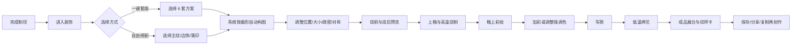

# 泥火青花：装饰纹样与写款系统 MVP PRD

> 文档状态：产品评审稿 v1.0  
> 更新日期：2026-08-25  
> 适用项目：泥火青花微信陶艺小程序  
> 适用版本：现有 v1 垂直切片之后的装饰体验增强版  
> 产品范围：装饰、纹样、釉上彩绘、写款及其在成品页中的呈现  
> 调研输入：`D:\下载文件\微信陶瓷小游戏_装饰纹样与写款系统调研.pdf`  
> 相关基线：`微信陶艺小程序产品需求文档_PRD.md`、当前仓库代码与数据结构

---

## 0. 执行摘要

### 0.1 一句话定义

把当前“点一个工具就切换一层全局程序纹样”的原型，升级为一套适合手机操作的轻量陶瓷装饰工作台：玩家可以先一键套用好看的构图，再用少量母纹样、边饰、工艺和写款做个性化调整，最终经过开窑获得一件有明确风格、能辨认出个人印记的作品。

### 0.2 MVP 核心判断

本版不追求海量贴图、专业绘画软件或完整历史复刻，而用四个能力形成可玩闭环：

1. **先给成品，再允许拆改**：默认提供 6 套一键构图，新手 30 秒内能获得完整效果。
2. **纹样按器物分区自动适配**：系统理解口沿、颈、肩、腹、足、盘心与底部，不让同一张图在不同器形上生硬拉伸。
3. **少量资产产生较多组合**：15 个母纹样、6 条边饰、3 个风格包、3 套配色和 3 种工艺表现，通过布局、密度、镜像与位置组合形成差异。
4. **写款成为创作收尾**：玩家可留下署名、日期或祝语，并保存一枚本机私款，让“系统生成的陶瓷”变成“我的作品”。

### 0.3 本版体验承诺

- 新手可以只做“选套版 → 换配色 → 写款”完成作品。
- 想多玩一点的用户可以拆分主纹、边饰和落印，调整位置、大小、密度和对称。
- 烧成差异可预览，结果允许有轻微纹理变化，但不使用随机失败破坏作品。
- 不改变现有七道工序，不引入登录、后端、社区、交易或用户上传素材。
- 保持泥火青花安静、克制、有手作感的工坊气质；不做积分排行、抽卡和强任务打断。

---

## 1. 背景与现状

### 1.1 产品背景

泥火青花当前已经完成“制坯 → 装饰 → 上釉 → 高温烧制 → 釉上彩绘 → 低温烤花 → 成品”的本地闭环。制坯、釉色、烧制和导出已经能建立基本工艺节奏，但装饰仍停留在技术演示层，用户很难通过装饰真正表达主题或留下个人印记。

调研材料提出的关键启发不是继续扩充贴图数量，而是把纹样组织成“母纹样 + 变体 + 分区 + 工艺 + 款识”的组合系统。这个方向与当前项目的程序化 WebGL、参数化作品数据和本地存储边界相匹配，也比自由 UV 绘画更适合作为下一步 MVP。

### 1.2 当前代码真实状态

| 领域     | 当前实现                                                  | 对体验的影响                                     |
| -------- | --------------------------------------------------------- | ------------------------------------------------ |
| 装饰工具 | 创作台展示刻线、压纹、印章、贴花、加杯耳                  | 点击后只追加固定位置记录，没有真实放置与编辑     |
| 装饰渲染 | WebGL 只读取最后一条装饰的类型，并映射到 4 种全局程序纹样 | 多次操作会互相覆盖，器物分区、大小和角度不生效   |
| 彩绘     | 颜色、1-4 程序纹样和三档对称                              | 没有真实纹样资产、图层或可见的对称结果           |
| 写款     | 无                                                        | 成品缺少署名、日期、编号和纪念信息               |
| 历史     | 页面内最多 50 个完整作品快照                              | 可复用，但新增装饰操作必须全部接入历史           |
| 保存     | 500 ms 防抖本地保存，隐藏/卸载时立即保存                  | 适合继续保存参数化装饰，不适合保存大量位图       |
| 渲染基础 | 轴对称 3D 网格含外壁、内壁、口沿、底面与内腔底面          | 可以扩展器身分区、盘心和底款，但需要明确表面映射 |
| 导出     | 成品图与海报由本地 Canvas 合成                            | 新纹样与写款必须在 3D 预览和导出中保持一致       |

### 1.3 主要问题

1. **选择不等于创作**：玩家目前只能切换效果，不能决定纹样放在哪里、如何组合。
2. **作品辨识度低**：同器形、同釉色的作品差异很小，分享价值不足。
3. **工序割裂**：泥上装饰与釉上彩绘会争用同一个程序纹样结果，无法叠加表达。
4. **文化内容无组织**：纹样没有名称、常见寓意、适用位置和工艺语境。
5. **缺少收尾仪式**：完成作品后只能改标题，没有真正落在器物上的款识。

---

## 2. 产品目标与非目标

### 2.1 产品目标

| ID  | 目标          | 目标描述                                                                       |
| --- | ------------- | ------------------------------------------------------------------------------ |
| G1  | 降低装饰门槛  | 首次用户不学习复杂工具，也能在 1 分钟内得到完整、协调的纹样构图                |
| G2  | 提高创作差异  | 同一器形和釉色下，玩家通过套版、纹样、边饰、位置、配色和写款得到明显不同的成品 |
| G3  | 建立个人归属  | 至少一半完成装饰的测试用户愿意添加署名、日期或祝语                             |
| G4  | 保留工艺感    | 泥上刻花、釉下青花、釉上彩与写款在流程、视觉和烧成反馈上有可理解差异           |
| G5  | 控制 MVP 成本 | 复用现有七工序、WebGL 1.0、本地存储和撤销链路，不引入后端与第三方运行时        |
| G6  | 支撑后续扩展  | 纹样、布局、工艺和款识均以参数保存，未来可以增加主题包而不修改每个器形         |

### 2.2 非目标

以下内容不进入本次 MVP：

- 任意自由笔刷、橡皮、吸色、六图层绘画和复杂 UV 跨缝笔迹。
- 用户上传图片、相册贴图、在线字体、公开 UGC 或作品交易。
- 杯耳、壶嘴、盖、钮等会改变网格拓扑的立体附件。
- 镂雕、堆塑、泥浆塑形、复杂贴塑与高精度凹凸位移。
- 手写识别、书法笔锋模拟、长诗排版和自定义字体导入。
- 历史年款鉴定、真品判断和对具体馆藏作品的复刻。
- 随机炸窑、不可逆损坏、评分排行、稀有度抽取或付费素材包。
- 云端账号、跨设备私款同步、在线内容审核和公共作品广场。

### 2.3 MVP 设计原则

1. **默认好看**：自动布局优先于参数自由，系统先确保作品完整。
2. **少而有差异**：每个选项必须明显改变作品，不用几十个近似缩略图制造虚假丰富。
3. **先整体后局部**：先选风格与构图，再拆改主纹、边饰和款识。
4. **轻松模式扶一把**：自动避开不适合的区域、限制过密叠放；自由模式允许更多调整，但仍保持渲染安全。
5. **结果可解释**：烧后变化来自工艺预设和可预览范围，不把随机数包装成真实窑变结论。
6. **文化表达留余地**：纹样说明使用“常见解释”“常见于”等措辞，不把复杂文化简化为唯一答案。

---

## 3. 用户与核心场景

### 3.1 目标用户

| 用户       | 主要需求                           | MVP 响应                                     |
| ---------- | ---------------------------------- | -------------------------------------------- |
| 轻松创作者 | 快速做出好看的作品，不想学专业工具 | 一键套版、自动分区、推荐配色、默认写款       |
| 亲子用户   | 操作直观，有一点知识性，结果可留念 | 大触控区、图形化纹样、短文化卡、日期/祝语款  |
| 文化体验者 | 了解纹样、工艺和器物之间的关系     | 风格包、工艺标签、常见寓意和适用位置说明     |
| 创意表达者 | 不满足于模板，希望作品有个人差异   | 拆件编辑、自由落印、密度/位置/对称和私款复用 |

### 3.2 核心 Jobs to Be Done

- 当我不知道怎么装饰时，我希望系统先给我一套完整方案，让我从“改一改”开始，而不是面对空白器物。
- 当我喜欢某个纹样时，我希望它能自动适配杯、碗、瓶、罐、盘，而不是在器表被拉扁或接缝断开。
- 当我想让作品更像自己做的时，我希望能移动主纹、换边饰、改疏密，并留下名字或日期。
- 当我准备烧制时，我希望知道烧后大致是什么颜色和质感，同时保留一点开窑期待。
- 当我完成一件满意的作品时，我希望可以复制它再改一版，而不是从头开始。

### 3.3 典型使用场景

1. 首次用户选择“莲池清韵”，系统自动把莲花放在腹部、海水放在足边；用户改成青花蓝并写下昵称，继续上釉。
2. 亲子用户选择“梅鹊报春”，把边饰从回纹换成如意云头，写下日期和“平安喜乐”，保存纪念海报。
3. 熟悉用户选择“自由搭配”，在瓶腹落下主纹，在肩部添加一圈边饰，开启四向环绕后调整密度。
4. 用户在成品页复制作品，保留器形和主纹，只更换釉色与款识，形成一组同系列作品。

---

## 4. MVP 范围

### 4.1 优先级定义

| 优先级 | 定义                                        |
| ------ | ------------------------------------------- |
| P0     | 本次 MVP 必须具备；缺失会破坏核心闭环或验收 |
| P1     | 可在 MVP 稳定后补充；不阻塞首版验证         |
| Out    | 明确不进入本轮，避免范围扩张                |

### 4.2 功能范围

| 模块     | P0                                                | P1                 | Out                      |
| -------- | ------------------------------------------------- | ------------------ | ------------------------ |
| 创作入口 | 6 套一键套版、自由搭配                            | 最近使用、收藏套版 | 在线主题商店             |
| 风格     | 宋式刻花、元明青花、现代工作室                    | 磁州黑白、清式粉彩 | 完整历史朝代库           |
| 纹样     | 15 个母纹样、6 条边饰                             | 扩至 30 个母纹样   | 用户上传素材             |
| 构图     | 自动分区、主纹、边饰、自由落印                    | 四季/节庆场景组件  | 复杂人物故事画           |
| 工艺     | 刻花、印花、釉下青花、釉上彩表现                  | 刷花、粉彩、墨彩   | 镂雕、堆塑、真实位移雕刻 |
| 调整     | 位置、大小、疏密、旋转、三档对称                  | 图层显隐、复制单层 | 专业路径节点编辑         |
| 写款     | 5 种版式、3 种表现、2 种字形、署名/日期/祝语/编号 | 手写款、长题款     | 识别真伪、复刻历史年款   |
| 烧成     | 烧前/烧后对比、确定性微变化                       | 多种窑口效果       | 随机失败与损坏           |
| 作品     | 参数化保存、撤销/重做、复制再创作                 | 私款合集           | 云同步、公开交易         |

### 4.3 首发内容量

#### 4.3.1 三个风格包

| 风格包     | 主色与质感               | 核心纹样                         | 主要工艺         | 产品定位                               |
| ---------- | ------------------------ | -------------------------------- | ---------------- | -------------------------------------- |
| 宋式刻花   | 牙白、青釉、同色浅浮雕   | 莲花、牡丹、莲瓣、鱼、回纹       | 刻花、印花       | 克制、安静、强调光影与手作痕迹         |
| 元明青花   | 白地青蓝、分水浓淡       | 缠枝花、鱼、鹤、祥云、海水、如意 | 釉下青花         | 识别度最高，适合首轮传播与教程         |
| 现代工作室 | 单色泥、留白、低饱和点色 | 几何线、寿/喜符号、云、植物剪影  | 线描、印色、写款 | 与当前泥火青花视觉最贴近，个性化空间大 |

风格包是视觉与参数预设，不是历史断代结论。界面使用“灵感来自”“常见于”等说明，不使用“复原”“真品级”等表述。

#### 4.3.2 母纹样与边饰

首发母纹样以识别度、组合能力和多器形适配为优先：

- 花卉植物：莲花、牡丹、梅、竹。
- 动物祥瑞：鱼、鹤、蝙蝠、蝴蝶、龙。
- 云水符号：祥云、海水。
- 吉祥与几何：寿字、回纹、如意、莲瓣。

其中回纹、如意云头、莲瓣、海水、缠枝、珠点提供专门的连续边饰版本。每个母纹样至少提供线稿、实色、镂空或印花中的 2 种可复用变体，不为每个器形重复制作贴图。

#### 4.3.3 六套一键套版

| 套版     | 默认组件                        | 推荐器形   | 默认风格              |
| -------- | ------------------------------- | ---------- | --------------------- |
| 莲池清韵 | 莲花主纹 + 双鱼/单鱼 + 海水边饰 | 碗、盘、罐 | 宋式刻花 / 青花可切换 |
| 梅鹊报春 | 梅枝主纹 + 鸟纹 + 如意云头      | 瓶、罐     | 元明青花              |
| 缠枝花卉 | 牡丹主纹 + 缠枝连续纹 + 莲瓣    | 瓶、罐、杯 | 元明青花              |
| 云鹤延年 | 鹤主纹 + 祥云 + 回纹            | 瓶、杯     | 青花 / 现代可切换     |
| 福寿相伴 | 寿字主纹 + 蝙蝠环绕 + 如意边饰  | 盘、罐、杯 | 宋式刻花 / 现代       |
| 留白几何 | 几何线带 + 珠点 + 玩家款        | 全器形     | 现代工作室            |

套版允许“整体应用”或“拆件编辑”。同一套版根据器形自动改变组件数量与位置，不要求在所有器形上完全一致。

---

## 5. 核心体验流程

### 5.1 主流程



### 5.2 与现有七道工序的关系

本 PRD 不新增或重排工序，只补齐装饰数据与交互：

| 现有工序 | 本版职责                                 | 规则                                       |
| -------- | ---------------------------------------- | ------------------------------------------ |
| 制坯     | 决定可用分区与构图比例                   | 器形完成后生成语义分区，不把像素位置写死   |
| 装饰     | 泥上刻花、印花、釉下青花、主纹与边饰构图 | 保存为“烧前装饰层”，后续彩绘不得覆盖其数据 |
| 上釉     | 选择釉色与施釉方法                       | 装饰预览同步显示釉层遮盖与留白影响         |
| 高温烧制 | 固化泥上装饰和釉下色                     | 只做可预期的烧成变化，不随机删除纹样       |
| 釉上彩绘 | 添加少量强调色、现代印色与写款           | 保存为“烧后彩绘层”，与烧前装饰叠加         |
| 低温烤花 | 固化釉上彩与款识                         | 颜色轻微融合，仍保持可辨识度               |
| 成品     | 展示纹样、款识、工艺与常见寓意           | 支持复制后再创作，不在此处继续直接改原成品 |

### 5.3 首次用户最短路径

```text
进入装饰
→ 默认选中“莲池清韵”
→ 点击“用这套”
→ 左右滑动选择青花/刻花表现
→ 点击“看烧后”确认
→ 进入后续工序
→ 釉上彩绘末尾点击“写款”
→ 使用默认昵称 + 当日日期
→ 完成烤花
```

目标：不含烧制转场，首次用户在 90 秒内完成装饰与写款决策。

---

## 6. 详细功能需求

### 6.1 装饰入口与模式

#### DEC-001 装饰首页

进入装饰工序后，底部工具区默认展示两种入口：

- **选一套**：展示 6 套可横滑预览的构图卡，是默认入口。
- **自己搭**：进入主纹、边饰、落印三个分类。

顶部保留现有工序状态、撤销、重做、保存状态和退出能力。画布区域继续以陶坯为唯一视觉中心，不新增全屏素材商城。

验收要点：

- 首次进入 300 ms 内出现默认套版的低成本预览；真实 WebGL 更新允许随后完成。
- 没有选择任何装饰时，允许直接进入下一步，不强迫添加纹样。
- 从“选一套”切到“自己搭”时，已应用的套版自动拆成可编辑组件，不丢失结果。

#### DEC-002 风格包切换

风格包切换只改变兼容的工艺、颜色与线条预设，不重置器形、釉色和款识。若某组件不支持目标风格，系统优先切换到同母纹样的兼容变体；没有兼容变体时保留组件并显示“此纹样保持原工艺”。

轻松模式默认只显示系统推荐的 3-4 个差异明显的方案；自由模式显示全部首发内容。

### 6.2 器物语义分区

#### DEC-003 分区模型

系统以语义锚点组织纹样，而不是按屏幕坐标或固定像素放置：

| 分区             | 适合内容                   | 自动布局规则                       |
| ---------------- | -------------------------- | ---------------------------------- |
| 口沿 `rim`       | 回纹、卷草、海水、珠点     | 细、密、连续，不放大型主纹         |
| 颈部 `neck`      | 蕉叶、竹、云纹、小题款     | 纵向生长，密度低于腹部             |
| 肩部 `shoulder`  | 缠枝、如意云头、莲瓣       | 用于主纹与口沿之间的过渡           |
| 腹部 `belly`     | 花鸟、鱼、龙、寿字等主纹   | 视觉主角，支持单幅、对称和四向环绕 |
| 足边 `foot`      | 莲瓣、海水、回纹、编号     | 向下收束，避免贴近最底边裁切       |
| 盘心/碗内 `well` | 团花、双鱼、寿字、单幅主纹 | 同心式、旋转式或居中式             |
| 底部 `base`      | 署名、日期、编号、印章     | 默认居中，提供方框、圆框和无框     |

#### DEC-004 器形适配

不同器形开放不同分区：

| 器形 | 默认主区    | 可选辅助区           | 说明                             |
| ---- | ----------- | -------------------- | -------------------------------- |
| 杯   | 腹部        | 口沿、足边、底部     | 主纹不靠近杯口，保证小屏可读     |
| 碗   | 外腹 / 盘心 | 口沿、足边、底部     | 套版需明确是外壁构图还是内心构图 |
| 花瓶 | 腹部        | 颈、肩、足边、底部   | 主纹优先落在最大腹径区域         |
| 罐   | 腹部        | 肩、口沿、足边、底部 | 适合四向主纹与连续边饰           |
| 盘   | 盘心        | 口沿、内圈、底部     | 主纹优先使用团花或环形布局       |

轻松模式中，不适合当前器形的分区和套版置灰并给出简短原因；自由模式允许选择更多位置，但仍禁止完全落在模型外或产生无法渲染的极端尺寸。

### 6.3 构图与纹样编辑

#### DEC-005 自动构图

一键套版应用后，系统根据器形和表面宽度完成以下工作：

1. 选择主纹所在分区和默认尺度。
2. 选择 0-2 条边饰，并避开主纹视觉中心。
3. 根据器形圆周计算重复次数，保证接缝闭合。
4. 为盘、碗使用同心构图，为瓶、罐使用肩腹足分层构图，为杯使用简化腰线构图。
5. 预留至少 20% 的主要可视面积，不让纹样铺满整件器物。

自动构图的结果必须可重复：同一作品、同一套版和同一参数重新打开时，结果保持一致。

#### DEC-006 主纹编辑

每件作品最多 2 个主纹层。选中主纹后显示四个控制项：

- 位置：在允许分区内上下拖动；横向拖动控制绕器物的角度。
- 大小：三档快捷值“小 / 适中 / 大”，自由模式额外提供连续滑杆。
- 旋转：每次 15° 吸附；长按进入连续调整。
- 对称：无对称、左右成对、四向环绕。

触控选中已有主纹时显示轮廓高亮，不使用密集的专业变换手柄。选中之外的背景仍用于旋转观察，双指仍只控制缩放和观察。

#### DEC-007 边饰编辑

每件作品最多 2 条连续边饰。玩家选择边饰后，先选择口沿、肩部或足边，再调整：

- 疏密：疏、适中、密三档。
- 宽度：细、中、宽三档。
- 相位：左右拖动，让接缝或中心图案避开正面。

系统沿圆周自动重复并微调间距，最后一格不得出现明显挤压、重叠或断缝。边饰与主纹发生重叠时，轻松模式自动缩小或移动边饰；自由模式显示提醒，但允许玩家保留可读的轻微叠加。

#### DEC-008 自由落印

“落印”用于增加手作参与感，每件作品最多放置 8 枚：

- 玩家选择纹样后，点击器表放置。
- 拖动已放置图案调整位置；再次点击进入大小与旋转调整。
- 支持左右成对和四向复制；复制仍计入 8 枚上限。
- 长按已选图案显示删除操作。

不记录原始触摸轨迹，只保存最终参数。落印靠近 UV/圆周接缝时自动吸附到安全区域或完成跨缝重复，不允许出现半枚被截断的结果。

### 6.4 工艺表现与烧成预览

#### DEC-009 工艺选择

MVP 对玩家只暴露容易理解的名称：

| 玩家名称 | 产品含义             | 适用工序 | 可调参数                 |
| -------- | -------------------- | -------- | ------------------------ |
| 刻花     | 泥坯表面浅凹线与阴影 | 装饰     | 浅 / 中两档深度          |
| 印花     | 规则、重复、略有压痕 | 装饰     | 清晰 / 手作两档边缘      |
| 青花     | 釉下蓝色，烧后显色   | 装饰     | 淡 / 中 / 浓三档         |
| 釉上彩   | 烧后增加强调色       | 釉上彩绘 | 6 个受控色卡             |
| 写款     | 底款或侧款           | 釉上彩绘 | 青花、印红、刻款三种表现 |

同一母纹样尽量共享轮廓路径，由工艺表现决定线宽、边缘、凹凸感、颜色和烧后变化。刻花不使用真正改变网格拓扑的深位移；通过法线、明暗和受控遮罩形成足够可信的浅刻效果。

#### DEC-010 烧前/烧后预览

装饰和写款面板均提供“看烧后”按住预览：

- 默认显示当前工序下的烧前状态。
- 按住后切换到确定性的烧后材质，松手返回。
- 预览同时显示釉色覆盖、青花浓淡、刻花阴影和釉上彩融合。
- 使用“效果会有轻微差异”提示范围，不显示精确成功概率。

开窑可以加入基于 `workId` 固定种子的轻微色差、边缘晕散或釉流变化，但同一作品每次打开和导出必须一致。变化幅度控制在不影响主纹识别和文字可读的范围内。

### 6.5 釉上彩与前序装饰叠加

#### DEC-011 彩绘不覆盖装饰

釉上彩绘阶段只新增“强调色层”和“款识层”，不得把前序刻花、印花或青花替换为另一种全局纹样。

首版不做自由画笔。玩家可以：

- 为支持彩绘的主纹切换 1 个强调色。
- 为局部纹样增加“点彩”变体。
- 添加、修改或删除写款。
- 查看烧后合成效果。

每件作品最多 1 个釉上强调色层，避免界面和渲染复杂度快速上升。

### 6.6 写款系统

#### DEC-012 写款入口

写款位于釉上彩绘阶段工具区末尾，并在用户点击“完成彩绘”时做一次轻量提醒：

> 留下一枚款识，让它真正成为你的作品。

写款可跳过，不弹二次确认。首次进入自动生成“玩家署名 + 当日日期”的预览，但在玩家点击“落款”前不写入作品。

#### DEC-013 写款内容

MVP 支持四类内容：

| 类型     | 默认内容                               | 限制                                 |
| -------- | -------------------------------------- | ------------------------------------ |
| 玩家署名 | 本机保存的创作名或“掌心作”             | 2-8 个中文、字母或数字               |
| 日期纪念 | 当前日期或玩家选择的纪念日期           | 只提供规范日期格式，不支持任意长文本 |
| 吉祥祝语 | 平安喜乐、福寿康宁、岁岁安好等预置短语 | 首发 12 条，均可直接替换             |
| 作品编号 | No. 001 或本机作品序号                 | 自动生成，允许隐藏                   |

自定义文本最多 12 个可见字符，允许中文、常用字母、数字和有限标点。禁止换行超过 2 行，不支持 emoji、控制字符和超出生僻字字库的字符。

本版无后端和公开作品流，自定义内容只保存在本机作品中。埋点、日志和错误信息不得记录文本内容。未来若上线云分享或公开 UGC，必须在开放前接入服务端内容安全和审核状态。

#### DEC-014 写款版式与表现

首发提供 5 种版式：

1. 2×2 方款。
2. 2×3 方款。
3. 横排短款。
4. 竖排短款。
5. 圆章款。

提供 3 种表现：青花、印红、刻款；提供 2 种经过授权并随包内置的字形：清雅楷意、篆意印文。若字形资源不可用，必须回退到稳定的内置字形，不依赖在线字体。

默认位置：

- 杯、瓶、罐：器底居中。
- 碗、盘：器底居中；玩家可切换到盘心侧记或外壁下部。
- 侧款：只开放在腹部下方的安全区域，不覆盖主纹。

“仿古年款”不进入 MVP。后续如加入，菜单必须明确标注“历史风格/仿古款”，不能暗示真品、年代或鉴定依据。

#### DEC-015 本机私款

玩家可以将当前署名、版式、表现和字形保存为一枚“我的私款”：

- 私款保存在本机设置中，不跟随单件作品删除。
- 新作品写款时默认推荐最近一次私款。
- 私款最多保存 3 枚；超过后由玩家选择替换，不自动删除。
- 私款只保存排版参数和文本，不生成用户画像，不参与埋点。

### 6.7 历史、保存与异常恢复

#### DEC-016 撤销与重做

以下每个动作都必须生成一条可撤销历史：

- 应用或移除套版。
- 新增、移动、缩放、旋转、复制或删除主纹/边饰/落印。
- 修改工艺、颜色、密度或对称。
- 新增、修改或删除写款。

连续拖动从按下到松手合并为一条历史，滑杆连续变化同样合并。撤销后再进行新操作必须清空重做栈。

#### DEC-017 自动保存

装饰数据继续复用现有 500 ms 防抖保存；工序完成、页面隐藏、退出、卸载和开始烧制前立即保存。保存失败时保留内存态并提示“这次修改还没落盘，请再试一次”，不得静默覆盖或删除旧作品。

重新打开草稿后，纹样位置、工艺、烧成种子、款识和当前选中工序必须完整恢复。成品复制后进入可编辑草稿时保留装饰和款识，但默认回到产品约定的可编辑阶段，不保留“草稿 + finished”的矛盾状态。

### 6.8 成品展示与再创作

#### DEC-018 成品信息卡

成品页在现有器形、泥料、釉色信息之外增加：

- 风格包名称。
- 主纹名称与一句“常见寓意”。
- 工艺标签，例如“浅刻 / 青花 / 釉上彩”。
- 款识内容的可见预览；若玩家选择隐藏，则只显示“已写款”。

文化说明最多 2 行，默认折叠，不遮挡 3D 成品。所有说明使用“常见解释”“常用于”等开放措辞。

#### DEC-019 作品导出

作品图、纪念海报和分享卡片中的纹样、釉色、款识必须与 3D 成品一致。海报允许展示款识、纹样名称和工艺标签，但默认不展示完整自定义祝语，避免私人内容被无意带入分享图；玩家可主动开启。

导出前不重新随机烧成效果。若 WebGL 截图失败，兜底图至少要保留器形、主色、主要纹样与款识摘要，不能退回通用占位陶器。

#### DEC-020 复制再创作

成品页增加“沿用纹样再做一件”入口：

- 复制器形、泥料、装饰、釉色和款识参数。
- 新作品状态为草稿，生成新 `workId`、创建时间和固定烧成种子。
- 玩家可选择“只沿用纹样”或“完整复制”。
- 不覆盖原成品，不共用后续可变状态。

---

## 7. 交互与界面要求

### 7.1 页面布局

延续当前创作台的沉浸式工坊结构，不新增独立复杂编辑页：

```text
┌────────────────────────────┐
│ 返回  装饰  2/7  已保存  撤销/重做 │
│                            │
│         3D 陶坯主舞台          │
│     选中纹样时显示轻量轮廓       │
│                            │
│  [看烧前]  工艺短提示  [看烧后]   │
├────────────────────────────┤
│ 选一套 | 自己搭                  │
│ 套版卡 / 主纹 / 边饰 / 落印       │
│ 位置  大小  疏密  对称             │
│ [跳过装饰]            [完成装饰 →] │
└────────────────────────────┘
```

写款沿用同一底部托盘，避免再打开深层表单。文本输入时使用小程序原生输入能力，预览保持在陶器上方可见。

### 7.2 手势矩阵

| 状态     | 单指命中纹样 | 单指命中空白器表 | 单指背景 | 双指      | 长按         |
| -------- | ------------ | ---------------- | -------- | --------- | ------------ |
| 浏览套版 | 选中组件     | 放置当前落印     | 旋转观察 | 缩放/旋转 | 查看纹样说明 |
| 编辑主纹 | 拖动位置     | 取消选中         | 旋转观察 | 缩放/旋转 | 删除/复制    |
| 编辑边饰 | 上下移动边饰 | 取消选中         | 旋转观察 | 缩放/旋转 | 删除         |
| 写款     | 拖动安全位置 | 取消选中         | 旋转观察 | 缩放/旋转 | 隐藏/删除    |

单指意图必须在短判定窗内区分“编辑纹样”和“转动相机”。纹样被选中且触点命中其轮廓时才进入编辑；其余情况沿用现有相机语义。

### 7.3 关键界面状态

| 状态         | 表现                                                       |
| ------------ | ---------------------------------------------------------- |
| 未装饰       | 展示 6 套方案与“也可以保持素面”                            |
| 正在生成预览 | 保留上一帧结果，卡片显示轻量进度，不让陶器闪空             |
| 组件选中     | 青釉色细轮廓 + 名称标签；颜色不是唯一选中信号              |
| 位置不兼容   | 组件半透明，区域用虚线标识，并说明“这里太窄，换到腹部试试” |
| 达到上限     | 不再新增，提示“主纹已经够丰富了，可以先换位置或删除一项”   |
| 保存中       | 沿用现有“保存中…”状态，不阻塞继续操作                      |
| 保存失败     | 顶部非模态提示，可重试；离开页面前再次尝试保存             |
| WebGL 失败   | 使用 2D 展开预览选择套版与写款；隐藏自由落印和精细位置调整 |

### 7.4 文案风格

使用工坊式、动作导向的短文案：

| 不使用         | 使用                         |
| -------------- | ---------------------------- |
| UV 映射失败    | 这枚纹样没有贴稳，点一下重试 |
| 参数超出范围   | 这里有点窄，向腹部挪一点     |
| Apply Template | 用这套                       |
| Layer Limit    | 纹样已经够丰富了             |
| Submit         | 完成装饰                     |
| Inscription    | 写款                         |

### 7.5 视觉要求

- 继续使用瓷白、松烟、青釉、湿泥、窑火、青花六个主色语义。
- 素材卡以线稿、局部器表预览为主，不使用高饱和电商式缩略图墙。
- 套版卡同时展示“器形轮廓 + 主纹位置 + 风格名”，不能只放一张纹样图。
- 选中、禁用、烧后和风险状态必须同时有文字或图形差异。
- 所有触控目标不小于 44 CSS px；横滑卡片不能与陶器旋转手势重叠。
- 开启“减少动态”后，关闭自动轮播、缩放弹性与非必要纹样入场动画，保留必要状态变化。

---

## 8. 内容与素材规范

### 8.1 纹样元数据

每个母纹样需要具备以下逻辑字段；字段名可在技术设计阶段调整，但语义必须保留：

| 字段           | 用途                     | 示例                      |
| -------------- | ------------------------ | ------------------------- |
| `motifId`      | 唯一标识                 | `lotus_scroll_01`         |
| `nameZh`       | 中文名称                 | 缠枝莲                    |
| `family`       | 植物/动物/几何/符号/云水 | `flora`                   |
| `roles`        | 主纹/边饰/地纹/团花      | `main,border`             |
| `stylePackIds` | 可用风格                 | `song_incise,yuan_blue`   |
| `techniques`   | 可用工艺                 | `incise,stamp,underglaze` |
| `anchors`      | 适用分区                 | `belly,shoulder,well`     |
| `repeatMode`   | 单体/带状/四向/径向      | `radial`                  |
| `densityRange` | 允许的重复密度           | `0.8-1.5`                 |
| `meaningNote`  | 常见寓意与语境           | 常见解释：清雅、连绵      |
| `sourceRefs`   | 调研或馆藏参考 ID        | `S6,S7`                   |
| `license`      | 原创/委托/可商用授权     | `original`                |

### 8.2 素材制作规则

- 母纹样优先使用自制矢量轮廓或可证明授权的素材，不直接描摹馆藏照片。
- 同一轮廓路径尽量复用于刻花、印花和绘制表现，避免资产数量成倍膨胀。
- 连续边饰必须包含明确的重复单元、基线和安全边界。
- 正面主视角、圆周接缝和器底翻转后都不能出现明显断裂或镜像文字。
- 文字资产与纹样资产分开管理，文字在运行时按版式生成，不把整段款识烘成不可编辑贴图。
- 历史参考图与游戏内成品资产分开存放；进入包体的素材必须有原创或授权记录。

### 8.3 文化内容规则

- 每个纹样只提供一句 20-40 字的简短说明和可选展开内容。
- 不把纹样寓意写成确定事实，使用“常见解释”“常用于表达”。
- 不把跨时代、跨窑口的组合包装成严格历史复原；自由搭配结果标记为“玩家创作”。
- 不使用具体在世艺术家风格作为风格包名称。
- 不提供真品、年代、窑口或价格鉴定结论。

---

## 9. 数据与系统约束

### 9.1 逻辑数据结构

为支持多层叠加，作品应从当前扁平字段升级为参数化装饰组合。建议逻辑结构如下：

```ts
interface DecorationComposition {
  stylePackId: string;
  templateId?: string;
  layers: DecorationLayer[]; // MVP 最多 5 层
  inscription?: Inscription;
  kilnSeed: number; // 保证烧成结果可重建
}

interface DecorationLayer {
  layerId: string;
  motifId: string;
  role: "main" | "border" | "stamp" | "accent";
  anchor: "rim" | "neck" | "shoulder" | "belly" | "foot" | "well" | "base";
  technique: "incise" | "stamp" | "underglaze" | "overglaze";
  repeatMode: "single" | "pair" | "four" | "band" | "radial";
  colorId?: string;
  u: number;
  v: number;
  scale: number;
  rotation: number;
  density: number;
  visible: boolean;
}

interface Inscription {
  contentType: "signature" | "date" | "blessing" | "serial";
  text: string;
  layoutId: string;
  styleId: "blue" | "seal_red" | "incised";
  typefaceId: string;
  anchor: "base" | "well" | "lower_belly";
  visibleInExport: boolean;
}
```

这是产品层逻辑契约，不要求实现时原样命名。关键要求是：烧前装饰、釉上彩、款识和烧成种子彼此独立，不能继续共用一个 `paintPattern` 覆盖最终结果。

### 9.2 版本与迁移

- 新结构需要提升 `schemaVersion`，并提供从当前 schema 1 到新版本的显式迁移。
- 旧 `decorations[]` 按最后一个有效类型迁移为 1 个 `legacy` 装饰层；旧 `paintPattern` 迁移为 1 个强调层。
- 无法识别的旧值必须保留原作品原始数据或创建可恢复副本，不得静默删除作品。
- 迁移后必须重新校验 `currentStage === STAGES[stageIndex].id`、内外轮廓长度和装饰枚举。
- 复制作品时必须深拷贝全部装饰层、款识与烧成种子，并生成新的层 ID。

### 9.3 渲染约束

- 使用器物自身角度和归一化高度建立稳定表面坐标；盘心、底部和外壁分别使用适合的映射。
- 单件作品同时渲染不超过 5 个装饰层、8 枚自由落印和 1 个款识。
- 低/中/高画质必须使用同一逻辑布局，只允许采样精度与抗锯齿不同。
- 纹样参数改变时只更新必要纹理或 uniform；不能因为移动一枚纹样就反复重建陶坯几何。
- 如果采用纹理图集，MVP 建议以 512×512 为低/中档基线，高档不超过 1024×1024；包体预算在技术设计阶段实测确认。
- 3D 预览、成品页和导出必须共用同一装饰合成结果，避免各自实现一套规则。

### 9.4 本地存储

- 作品只保存纹样 ID、布局参数、款识文本和烧成种子，不保存每帧截图或触摸轨迹。
- 单件作品新增装饰数据建议控制在 50 KB 内；超限时先限制层数，不静默截断数据。
- 私款使用独立本地 key，默认最多 3 枚。
- 存储写入失败不能破坏原作品；先验证新数据，再替换旧数据。

---

## 10. 非功能需求

### 10.1 性能

| 指标               | 目标                                                   |
| ------------------ | ------------------------------------------------------ |
| 装饰面板首次可操作 | 进入工序后 500 ms 内                                   |
| 套版预览反馈       | 点击后 100 ms 内出现视觉反馈，完整更新 300 ms 内       |
| 拖动纹样延迟       | 中档设备主观跟手，无连续 3 帧以上冻结                  |
| 渲染帧率           | 中档机稳定 40 FPS 左右；低端机不低于 28 FPS 的可用体验 |
| 自动保存           | 停止操作后 1 秒内完成本地持久化                        |
| 恢复               | 重新进入后装饰结果与离开前一致，不重新随机             |

### 10.2 稳定性

- 任意纹样参数不得生成 NaN、GPU 错误、黑屏或无法导出的作品。
- 页面隐藏、卸载和进入烧制时必须停止未完成的预览任务并保存最终参数。
- WebGL 初始化失败时仍可通过套版、配色和写款完成核心流程。
- 素材缺失时只隐藏对应素材并显示可读错误，不影响已有作品加载。

### 10.3 可访问性

- 颜色不是工艺、选中和烧成状态的唯一表达。
- 纹样卡提供名称，图标提供可读文本，按钮有明确 `aria-label`。
- 款识输入支持系统键盘，错误说明紧邻输入框。
- 开启减少动态后，不自动旋转陶器；烧前/烧后对比改用静态切换。
- 核心流程不依赖声音或震动；震动只作为确认增强。

### 10.4 隐私与内容安全

- 不记录触摸点、纹样移动轨迹、作品名、款识文本、导出图片或用户私款。
- 本地匿名事件只记录功能 ID、风格包 ID、工艺 ID、耗时和成功/失败状态。
- 自定义款识不上传网络；未来开放公共分享前必须重新评估内容审核、字体授权和隐私告知。

---

## 11. 数据指标与埋点

### 11.1 MVP 成功指标

由于当前项目没有后端，本版先用受控可用性测试和本机匿名事件验证，不把“上线增长指标”伪装成已有数据。

| 维度     | 指标                            | 目标                         |
| -------- | ------------------------------- | ---------------------------- |
| 易用性   | 首次用户独立应用一套纹样        | 80% 以上无需额外讲解         |
| 效率     | 从进入装饰到完成装饰的中位时长  | 2-4 分钟                     |
| 参与     | 完成作品中使用至少 2 个装饰组件 | 60% 以上                     |
| 归属     | 完成装饰的用户添加写款          | 50% 以上                     |
| 玩法     | 使用“拆件编辑”或“自由落印”      | 35% 以上                     |
| 完成     | 进入装饰后最终到达成品页        | 不低于当前基线，目标提升 10% |
| 结果价值 | 成品保存图片或生成海报          | 40% 以上                     |
| 稳定性   | 装饰相关致命错误或作品损坏      | 0；可恢复错误低于 1%         |

### 11.2 建议事件

| 事件                   | 触发                   | 允许字段                               |
| ---------------------- | ---------------------- | -------------------------------------- |
| `decorate_enter`       | 进入装饰               | 器形、模式、是否旧作品                 |
| `decor_template_apply` | 应用套版               | 套版 ID、风格包 ID                     |
| `decor_layer_add`      | 新增主纹/边饰/落印     | 角色、纹样 ID、工艺 ID                 |
| `decor_layer_adjust`   | 一次拖动或参数调整结束 | 调整类型，不记录坐标和值               |
| `decor_preview_fired`  | 查看烧后               | 工艺 ID、持续时间                      |
| `inscription_add`      | 落款成功               | 内容类型、版式 ID、表现 ID，不记录文本 |
| `decorate_complete`    | 完成装饰               | 层数、是否套版、是否写款、耗时         |
| `decor_restore_error`  | 恢复失败               | schema 版本、错误码，不记录作品数据    |

事件仍只保存在现有本地匿名事件队列，最多 200 条。若后续接入上报，需要另行评审隐私与采样策略。

---

## 12. 功能验收标准

### 12.1 P0 验收清单

| ID    | 验收项     | 通过标准                                                  |
| ----- | ---------- | --------------------------------------------------------- |
| AC-01 | 一键套版   | 5 种器形均可应用 6 套中的兼容方案，结果不拉伸、不穿出器表 |
| AC-02 | 器物分区   | 口沿、颈、肩、腹、足、盘心、底部按器形正确开放与禁用      |
| AC-03 | 主纹编辑   | 可移动、缩放、旋转、切换对称；重开草稿后结果一致          |
| AC-04 | 连续边饰   | 圆周闭合无明显断缝，密度与宽度三档差异清楚                |
| AC-05 | 自由落印   | 可放置、移动、删除，最多 8 枚；接缝处不出现半枚截断       |
| AC-06 | 工艺表现   | 刻花、印花、青花、釉上彩在烧前与烧后有可识别差异          |
| AC-07 | 层级叠加   | 泥上装饰、釉上强调色和写款同时存在，后操作不覆盖前操作    |
| AC-08 | 写款       | 5 版式 × 3 表现 × 2 字形可组合；底款翻转查看方向正确      |
| AC-09 | 文本限制   | 超长、emoji、控制字符和不支持字符有明确提示，不导致白屏   |
| AC-10 | 历史       | 所有装饰与写款变更可撤销/重做；连续拖动只产生一条历史     |
| AC-11 | 自动保存   | 退出、切后台、烧制前均保存；异常退出后可恢复最新完整状态  |
| AC-12 | 烧成一致   | 同一作品每次查看、导出和分享预览的烧成结果一致            |
| AC-13 | 成品信息   | 正确显示纹样名、工艺和常见寓意；文化说明不作唯一结论      |
| AC-14 | 复制再创作 | 新旧作品互不影响，新作品状态与工序一致，可继续编辑        |
| AC-15 | 导出       | 作品图与海报中的纹样、釉色、写款与 3D 预览一致            |
| AC-16 | 降级       | WebGL 失败时能选择套版、配色和写款并完成流程，不白屏      |
| AC-17 | 性能       | 低/中/高画质均可完成全流程，低端机没有持续卡死或内存崩溃  |
| AC-18 | 隐私       | 本地事件和日志中不存在款识文本、作品名、图片或触摸坐标    |

### 12.2 关键组合测试矩阵

至少覆盖：

1. 5 种器形 × 3 个风格包。
2. 3 种泥料 × 12 种釉色中的代表性色：浅釉、深釉、高饱和釉、近白釉。
3. 刻花、印花、青花、釉上彩、写款五种表现同时与不同施釉方式组合。
4. 无对称、左右成对、四向环绕三种构图。
5. 低/中/高画质，以及 WebGL 失败兜底。
6. 草稿恢复、撤销/重做、页面切后台、强制退出后重进。
7. 成品图、海报、相册保存和分享卡片生成。
8. 超长款识、空文本、不支持字符、重复私款和存储写入失败。

### 12.3 体验验收任务

邀请至少 8 名未接触项目的用户完成三项任务：

1. 不看说明，为花瓶套用一套青花方案并改动一个边饰。
2. 为盘添加一个居中主纹和日期款。
3. 复制成品，沿用纹样但更换釉色和署名。

观察是否能发现入口、是否误转相机、是否理解烧前/烧后、是否知道写款已成功。测试过程中只记录任务结果和口头反馈，不采集原始创作内容。

---

## 13. 建议实施节奏

本节用于控制依赖与验收顺序，不构成固定工期承诺。

### 阶段 0：数据契约与兼容

- 定义装饰组合、纹样元数据、款识和烧成种子。
- 升级 schema，完成旧作品迁移与异常保留策略。
- 建立纯函数测试：器形分区、套版布局、边饰闭合和数据校验。

### 阶段 1：最小渲染闭环

- 实现稳定的器表坐标、分区遮罩和最多 5 层装饰合成。
- 先接入 3 个代表纹样、1 条边饰、3 种工艺和 1 个底款。
- 打通创作台、成品页和导出的一致结果。

### 阶段 2：编辑器与历史

- 上线一键套版、主纹、边饰、自由落印与轻量参数托盘。
- 接入撤销/重做、自动保存、异常恢复和 WebGL 失败兜底。
- 完成触控意图与相机手势冲突测试。

### 阶段 3：写款与成品闭环

- 完成 5 种版式、3 种表现、2 种字形和本机私款。
- 成品页增加纹样卡、款识展示和“沿用纹样再做一件”。
- 修复复制作品的草稿阶段一致性。

### 阶段 4：内容扩充与打磨

- 补齐 15 个母纹样、6 条边饰、6 套套版和 3 个风格包。
- 完成烧前/烧后对比、固定种子微变化、文案与文化说明。
- 执行完整矩阵、真机性能与导出一致性验收。

---

## 14. 风险与应对

| 风险               | 影响                     | MVP 应对                                                     |
| ------------------ | ------------------------ | ------------------------------------------------------------ |
| 纹样像普通贴纸     | 失去陶瓷工艺感           | 由工艺决定边缘、深浅、法线和烧后色，不只切换颜色             |
| 器形差异导致拉伸   | 瓶肩、盘心和碗内效果失真 | 使用语义分区与独立映射，套版按器形调整，不共用固定像素       |
| 连续边饰无法闭合   | 正面或背面出现明显接缝   | 按圆周自动计算重复数并微调间距，预留安全相位                 |
| 移动端手势冲突     | 玩家想转动却误改纹样     | 只有命中已选轮廓才编辑，其余区域维持相机语义                 |
| 多层导致性能下降   | 低端机卡顿、导出失败     | 最多 5 层、8 枚落印，参数化合成，按画质降低采样              |
| 烧成随机破坏作品   | 用户挫败且结果不可复现   | 使用固定种子和小幅变化，所有风险均可预览                     |
| 字体包体与授权问题 | 款识缺字或合规风险       | 只内置 2 套已授权子集，字符白名单，稳定回退                  |
| 历史年款误导       | 产生鉴定或文化错误       | MVP 不提供仿古年款；后续必须明确标注历史风格                 |
| 自定义款识不当     | 分享与内容安全风险       | 本版仅本地、限制字符且不记录文本；公开 UGC 前接服务端审核    |
| 旧作品迁移失败     | 用户作品丢失             | 显式 schema 迁移、保留原始数据、失败时只读打开或创建恢复副本 |
| 资源扩充失控       | MVP 变成长期美术工程     | 先用 3 个代表纹样验证渲染，再补齐清单；不为每个器形重复制作  |

---

## 15. 后续版本方向

### 15.1 P1：增强内容与手感

- 增加磁州黑白、清式粉彩两个风格包。
- 扩充到 30 个母纹样与 12 套场景组合。
- 加入少量自由线描、橡皮和局部点彩，但仍限制图层数量。
- 增加节气、生日、婚礼、毕业等祝语与纪念套版。
- 支持收藏套版、最近使用和一键换器形预览。

### 15.2 V2：创作系统

- 完整自由笔刷、跨缝绘画、图层与手写款。
- 镂雕、堆塑、泥浆装饰、复杂附件和真实凹凸位移。
- 云端账号、跨设备私款、主题发布与受审核 UGC。
- 每周挑战、系列收藏和共同创作，但仍不以强排行破坏治愈体验。

---

## 16. 已定产品决策与待验证假设

### 16.1 已定决策

1. 保留七道工序，不把装饰与釉上彩合并成一个大编辑器。
2. 首版以一键套版为默认，以拆件编辑和自由落印提供可玩性。
3. 首发只做 3 个风格包、15 个母纹样、6 条边饰和 6 套套版。
4. 不做自由画笔、上传素材、仿古年款和复杂历史复刻。
5. 写款支持有限自定义，但只存本机、不采集文本、不进入公开内容流。
6. 开窑微变化必须可预览、可重建、不可破坏作品。
7. 文化说明提供语境与常见解释，不给唯一寓意或鉴定结论。

### 16.2 待验证假设

| 假设                                | 验证方法           | 通过信号                             |
| ----------------------------------- | ------------------ | ------------------------------------ |
| 6 套套版足以降低空白焦虑            | 首次用户任务测试   | 80% 用户在 30 秒内选定并应用         |
| 位置/大小/疏密/对称已经有足够可玩性 | 观察拆件编辑使用率 | 35% 以上用户主动调整至少一项         |
| 底款比侧款更符合用户预期            | 对比默认位置选择   | 70% 以上用户保留底款或能理解翻转查看 |
| 3 个风格包差异足够明显              | 无文案盲测         | 大多数用户能说出至少两组明显差异     |
| 固定种子微变化能增加开窑期待        | 访谈与重复查看行为 | 用户感到有惊喜，但不认为结果失控     |

---

## 17. PRD 完成定义

本需求可以进入完成验收，必须同时满足：

- P0 功能与 AC-01 至 AC-18 全部通过。
- 旧作品迁移、草稿恢复、撤销/重做和复制再创作无数据一致性问题。
- 5 种器形在低/中/高画质下均能正确展示主纹、边饰和款识。
- 装饰、成品页与导出结果一致，固定烧成结果不会在重开后变化。
- WebGL 失败时仍能完成套版、配色、写款和成品流程。
- 纹样与字形资产具有明确原创或授权记录。
- 本地事件、日志和导出流程不采集款识文本及创作原始内容。
- 至少完成一轮 8 人首次用户任务测试，并记录待优化问题与是否阻塞上线。

---

## 附录 A：调研输入与本 PRD 的取舍

| 调研建议                                         | 本 PRD 处理                                      | 原因                                       |
| ------------------------------------------------ | ------------------------------------------------ | ------------------------------------------ |
| 先做陶瓷装饰工作台，不做贴图库                   | 采纳                                             | 与参数化 WebGL 和长期内容扩展一致          |
| 首发 40 母纹样、18 边饰、24 款识模板             | 缩减为 15 母纹样、6 边饰、5 版式                 | 先验证玩法与技术链路，控制美术和测试成本   |
| 画笔、刻刀、印模、梳篦、泥浆、施釉、写款七类工具 | MVP 聚焦套版、主纹、边饰、落印、有限工艺和写款   | 当前项目尚无稳定 UV 绘画与复杂凹凸系统     |
| 六个首发风格包                                   | 首发 3 个：宋式刻花、元明青花、现代工作室        | 覆盖质感、经典绘画和低门槛个性表达三种差异 |
| 7 版式 × 4 表现 × 3 字形                         | 缩减为 5 版式 × 3 表现 × 2 字形                  | 足够形成明显组合，同时降低字库与排版风险   |
| 装饰、开窑、评分、收藏、再创作                   | 保留装饰、开窑、收藏式作品管理和再创作，暂不评分 | 当前产品强调安静创作，不引入比较与排名     |
| 仿古年款                                         | 不进入 MVP                                       | 避免历史误导、字体和鉴定语义风险           |
| 随机窑变与缺陷                                   | 只保留可预览、固定种子的轻微变化                 | 保留惊喜，不破坏用户投入                   |
| 元数据驱动组合                                   | 完整采纳                                         | 避免每个器形重复贴图，是后续主题扩展的基础 |

## 附录 B：与当前项目的关键改动点

本 PRD 进入技术设计时，至少需要覆盖以下现有边界：

- `core/model.ts`：升级作品 schema，拆分装饰层、彩绘层、款识和烧成种子。
- `core/catalog.ts`：增加纹样、边饰、风格包、套版与文化说明配置。
- `pages/studio/studio.ts`：补齐装饰状态、触控编辑、历史、保存和工序叠加。
- `pages/studio/studio.wxml/.wxss`：增加套版、拆件编辑、烧后预览和写款托盘。
- `core/pottery-engine.ts`：从单一全局程序纹样升级为分区、多层和底款合成。
- `core/pottery-mesh.ts`：确认外壁、内壁、盘心与底面的稳定映射和法线方向。
- `services/storage.ts`：增加 schema 迁移、校验、异常保留与复制深拷贝。
- `pages/result/result.ts`：保证成品、导出、海报、纹样卡和复制再创作一致。
- `services/analytics.ts`：增加不含文本和坐标的本地装饰事件。
- `tests/`：新增布局、迁移、边饰闭合、参数校验与渲染契约测试。

本附录只标出影响面，不替代后续技术方案。实施前仍需以届时代码为准确认接口与依赖。
